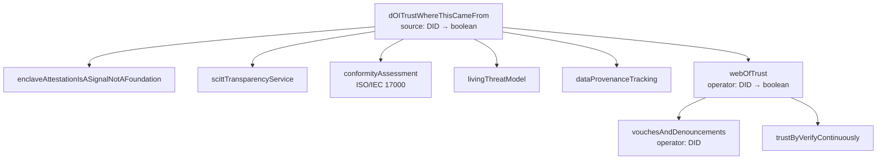
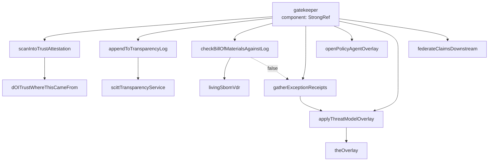
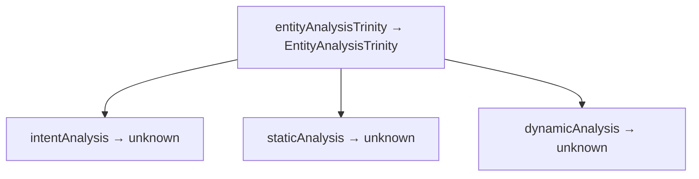
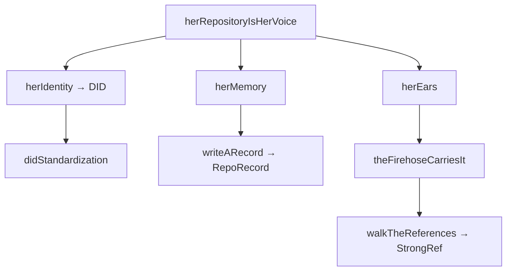

# Alice Open Architecture — Caveman Report

State: 48/691 comms processed (6.95%). 35 concepts, 30 stubs, 9 issues.
Built from process-eng-comms.ts feeding 691 engineer discussion logs to AI agent.

## Batch History

```
Batch 1: 6 concepts found, 103.3s, 5 new, 1 refinement, 1 attempt
Batch 2: 4 concepts found, 198.1s, 4 new, 0 refinement, 2 attempts
Batch 3: 7 concepts found, 213.6s, 3 new, 4 refinement, 2 attempts
```

3 batches, 17 total concepts found. Efficiency dropping (new/attempt
ratio: 5.0 → 2.0 → 1.5). More refinement needed as concept space fills.

## Package Sizes (function/type count → ASCII bar)

```
alice-common              14 ██████████████
alice-system-context      20 ████████████████████
alice-supply-chain        15 ███████████████
alice-trust               10 ██████████
alice-stream-of-conscious 10 ██████████
alice-compute-contract     9 █████████
alice-communication        8 ████████
alice                      6 ██████
```

Total: 92 symbols across 8 packages. All ABC layer currently (interfaces +
pure state). No impl/factory/CLI layers yet — stubs (30/35 = 85.7% stub
rate).

Dep direction: common ← abc (one-way). No cycles.

## Dependency Map (inter-package imports)

```
alice-common (types only)
    ^
    +---- alice (spine) ----+
    |                       |
    +---- alice-trust       |
    |        ^              |
    |        |              |
    +---- alice-supply-chain+
    |        |              |
    +---- alice-system-context
    |        ^              |
    |        |              |
    +---- alice-compute-contract
    |                       |
    +---- alice-communication
    |                       |
    +---- alice-stream-of-consciousness
                             |
                    (imports system-context)
```

`alice` (spine) imports all other abc packages. `alice-supply-chain` imports
`alice-trust`. `alice-stream-of-consciousness` imports `alice-system-context`.
`alice-compute-contract` imports `alice-trust`. No other cross-package imports.

---

## SUBSYSTEM: puttingItTogether (THE SPINE)

Entry: `alice/mod.ts:87`. Called with `{ source: string }` (build event).
Wireframe of entire Alice loop. Every path below called from here.

```mermaid
graph TD
  PIT[puttingItTogether] --> HRV[herRepositoryIsHerVoice]
  PIT --> DIT[dOITrustWhereThisCameFrom]
  PIT --> GK[gatekeeper]
  PIT --> GMWR[getMyWorkRun]
  PIT --> TMD[thinkMoreDeeply]

  HRV --> HI[herIdentity]
  HRV --> HM[herMemory]
  HRV --> HE[herEars]
  HI --> DS[didStandardization]
  HM --> WR[writeARecord]
  HE --> TFH[theFirehoseCarriesIt]
  TFH --> WTR[walkTheReferences]

  DIT --> EAS[enclaveAttestationIsASignalNotAFoundation]
  DIT --> STS[scittTransparencyService]
  DIT --> CA[conformityAssessment]
  DIT --> LTM[livingThreatModel]
  DIT --> DPT[dataProvenanceTracking]
  DIT --> WOT[webOfTrust]
  WOT --> VAD[vouchesAndDenouncements]
  WOT --> TBVC[trustByVerifyContinuously]

  GK --> SITA[scanIntoTrustAttestation]
  GK --> ATL[appendToTransparencyLog]
  GK --> CBML[checkBillOfMaterialsAgainstLog]
  GK --> GER[gatherExceptionReceipts]
  GK --> OPOA[openPolicyAgentOverlay]
  GK --> ATMO[applyThreatModelOverlay]
  GK --> FCD[federateClaimsDownstream]
  SITA --> DIT
  ATL --> STS
  CBML --> LSBV[livingSbomVdr]
  GER --> ATMO
  ATMO --> TO[theOverlay]

  GMWR --> PCRFP[publishCCRFP]
  GMWR --> BAWCCB[biddersAnswerWithCCB]
  GMWR --> PEPAB[policyEnginePicksABidder]
  GMWR --> AWCCBA[acceptWithCCBA]
  GMWR --> PPTT[payPerTheTerms]
  GMWR --> BPCCR[bobPublishesCCR]
  PEPAB --> DIT

  TMD --> EAT[entityAnalysisTrinity]
  EAT --> IA[intentAnalysis]
  EAT --> SA[staticAnalysis]
  EAT --> DA[dynamicAnalysis]
```



Text tree:

```
puttingItTogether(buildEvent: { source: string })
├── herRepositoryIsHerVoice()
│   ├── herIdentity() → DID "did:plc:"
│   │   └── didStandardization() — DID 1.0 W3C Rec July 2022
│   ├── herMemory()
│   │   └── writeARecord() → RepoRecord {uri, cid, author, value}
│   └── herEars()
│       └── theFirehoseCarriesIt()
│           └── walkTheReferences() → StrongRef {uri, cid}
├── doITrustWhereThisCameFrom(source) → boolean
│   ├── enclaveAttestationIsASignalNotAFoundation()
│   ├── scittTransparencyService()
│   ├── conformityAssessment() — ISO/IEC 17000 1st/2nd/3rd party
│   ├── livingThreatModel()
│   ├── dataProvenanceTracking()
│   └── webOfTrust(operator) → true
│       ├── vouchesAndDenouncements(operator)
│       └── trustByVerifyContinuously()
├── gatekeeper(component: StrongRef)
│   ├── scanIntoTrustAttestation → doITrustWhereThisCameFrom
│   ├── appendToTransparencyLog → scittTransparencyService
│   ├── checkBillOfMaterialsAgainstLog → livingSbomVdr
│   ├── gatherExceptionReceipts → applyThreatModelOverlay
│   ├── openPolicyAgentOverlay()
│   ├── applyThreatModelOverlay → theOverlay
│   └── federateClaimsDownstream()
├── getMyWorkRun() → CCR
│   ├── publishCCRFP() → CCRFP {request: Manifest}
│   ├── biddersAnswerWithCCB(rfp) → CCB[]
│   ├── policyEnginePicksABidder(bids) → CCB
│   │   └── filter by doITrustWhereThisCameFrom(bid.bidder)
│   ├── acceptWithCCBA(bid) → CCBA
│   ├── payPerTheTerms(accept)
│   └── bobPublishesCCR(accept) → CCR {chain, evidence}
└── thinkMoreDeeply()
    └── entityAnalysisTrinity() → {intent, staticAnalysis, dynamicAnalysis}
        ├── intentAnalysis() → undefined (STUB)
        ├── staticAnalysis() → undefined (STUB)
        └── dynamicAnalysis() → undefined (STUB)
```

---

## SUBSYSTEM: doITrustWhereThisCameFrom (TRUST)

Entry: `alice-trust/mod.ts:25`. First question on every thought. Returns
boolean. Foundation: web of trust, not hardware.



Text tree:

```
doITrustWhereThisCameFrom(source: DID) → boolean
├── enclaveAttestationIsASignalNotAFoundation()
│   — TEE attestation = signal, never foundation
│   — tee.fail: memory bus interposition breaks TEE isolation
├── scittTransparencyService()
│   — Content-agnostic transparency registry
│   — Holds SBOMs, attestations, system contexts, policies
│   — Alice encodes her system contexts into SCITT chain
├── conformityAssessment()
│   — ISO/IEC 17000: 1st/2nd/3rd party attestation
│   — Weighted by web of trust history
├── livingThreatModel()
│   — Threats, mitigations, trust boundaries
│   — Evolves with every attestation through gatekeeper
│   — Living SBOM VDR (NIST) feeds vulnerability updates
├── dataProvenanceTracking()
│   — Provenance on inference ← training data ← model env ← config
│   — Feeds prioritizer for intent-based policy decisions
└── webOfTrust(operator: DID) → boolean (always true STUB)
    ├── vouchesAndDenouncements(operator)
    │   — Records over time, walked as train of thought
    └── trustByVerifyContinuously()
        — Re-evaluated forever, never decided once
```

Key insight: `webOfTrust` always returns `true` — STUB. Real impl must
evaluate vouch/denounce records. Trust graph not yet queryable.

---

## SUBSYSTEM: gatekeeper (SUPPLY CHAIN)

Entry: `alice-supply-chain/mod.ts:26`. Loop: scan → attest → log → check
→ admit (with overlay) → federate. Takes StrongRef, no return (void).



Text tree:

```
gatekeeper(component: StrongRef)
├── 1. scanIntoTrustAttestation(component) → StrongRef
│   └── doITrustWhereThisCameFrom("did:plc:")
│       — Trusted or untrusted, pinned to exact repo+commit
├── 2. appendToTransparencyLog(attestation)
│   └── scittTransparencyService()
│       — Append only. Indexed. Feeds next round.
├── 3. checkBillOfMaterialsAgainstLog(component) → boolean
│   └── livingSbomVdr() — NIST VDR, always-updated vuln status
│   └── if FALSE → gatherExceptionReceipts
│       └── applyThreatModelOverlay() — re-issue with exceptions
├── 4. openPolicyAgentOverlay()
│   — OPA → JSON → DID/VC/SCITT. Admission + evaluation policy.
├── 5. applyThreatModelOverlay()
│   └── theOverlay() — policy/deployment/threat model patched on top
└── 6. federateClaimsDownstream()
    — Provenance intact, decision travels to every downstream forge
```

`checkBillOfMaterialsAgainstLog` always returns `true` — STUB. Real impl
needs SBOM parsing + transparency log query. Exception path (gather)
triggers only when check fails — currently unreachable.

---

## SUBSYSTEM: getMyWorkRun (COMPUTE CONTRACTS)

Entry: `alice-compute-contract/mod.ts:29`. 6-step lifecycle: RFP → bid →
pick → accept → pay → receipt. Returns CCR.

```mermaid
graph TD
  GMWR[getMyWorkRun → CCR] --> PCRFP[publishCCRFP → CCRFP]
  GMWR --> BAWCCB[biddersAnswerWithCCB → CCB array]
  GMWR --> PEPAB[policyEnginePicksABidder → CCB]
  GMWR --> AWCCBA[acceptWithCCBA → CCBA]
  GMWR --> PPTT[payPerTheTerms]
  GMWR --> BPCCR[bobPublishesCCR → CCR]

  PCRFP --> M[Manifest {intent, schema, data}]
  BAWCCB --> EMPTY[empty array STUB]
  PEPAB --> DIT[doITrustWhereThisCameFrom]
  AWCCBA --> SR[StrongRef {uri, cid}]
  BPCCR --> CHAIN[chain: request + bid + accept StrongRefs]
```

Text tree:

```
getMyWorkRun() → CCR
├── Step 1: publishCCRFP() → CCRFP
│   └── { request: { intent: "", schema: undefined, data: undefined } }
│   — Alice publishes what she needs built/run
├── Step 2: biddersAnswerWithCCB(rfp) → CCB[]
│   └── [] (STUB — no bidders yet)
│   — Bob and Eve each answer with CCB against request
├── Step 3: policyEnginePicksABidder(bids) → CCB
│   └── filter by doITrustWhereThisCameFrom(bid.bidder)
│   — Alice's policy engine reads trust graph, picks trusted bidder
├── Step 4: acceptWithCCBA(bid) → CCBA
│   └── { accepts: { uri: "at://", cid: "" } }
│   — She accepts with CCBA against chosen bid
├── Step 5: payPerTheTerms(accept)
│   — Receipts are the only currency. No shared token.
│   — npx awal x402 pay https://builder.bob.example.com/ccr/${AT_URI}/${CID}
└── Step 6: bobPublishesCCR(accept) → CCR
    └── { chain: {request, bid, accept}, evidence: undefined }
    — Receipt = proof work done as agreed, signed over whole chain
```

Types (from alice-common):
- CCRFP = { request: Manifest }
- CCB = { against: StrongRef, bidder: DID, terms: unknown }
- CCBA = { accepts: StrongRef }
- CCR = { chain: { request, bid, accept: StrongRef }, evidence: unknown }

Chain links via StrongRef (uri + cid). Walk references = walk whole
contract history.

---

## SUBSYSTEM: onEvent (STREAM OF CONSCIOUSNESS)

Entry: `alice-stream-of-consciousness/mod.ts:96`. Literal translation of
Python `on_event` pseudocode. Decision: notify, think, or ignore.

```mermaid
graph TD
  OE[onEvent<br/>event: unknown] --> KG[knowledgeGraph]
  OE --> DCEI[dataflowCacheExportImport]
  OE --> IR{isRelevant?}
  IR -->|false| DROP[drop event]
  IR -->|true| SUM[summarize → changes]
  SUM --> PRI[prioritizer → notify|think|act]
  PRI --> KG2[knowledgeGraph]
  PRI -->|notify| NOT[notify → notify-send]
  PRI -->|think/act| TMD[thinkMoreDeeply]
  TMD --> EAT[entityAnalysisTrinity]
  EAT --> IA[intentAnalysis]
  EAT --> SA[staticAnalysis]
  EAT --> DA[dynamicAnalysis]
```

Text tree:

```
onEvent(event: unknown)
├── knowledgeGraph(event)
│   — Stores event. Each entry carries provenance through inference chain.
├── dataflowCacheExportImport()
│   — Export orchestrator input network to pickle/JSON. Re-import to resume.
│   — GraphQL query of cached state (strawberry library).
├── isRelevant(event) → boolean
│   └── false (STUB — never relevant yet)
│   — Source she trusts, context she's in.
├── [if relevant]
│   ├── summarize(event) → unknown
│   │   └── undefined (STUB)
│   ├── prioritizer(changes) → "notify" | "think" | "act"
│   │   ├── knowledgeGraph(changes) — remembers
│   │   └── "think" (STUB — always think, never notify/act)
│   └── if "notify" → notify(changes) — notify-send popup
│       if "think"/"act" → thinkMoreDeeply()
│           └── entityAnalysisTrinity()
│               ├── intentAnalysis() → undefined (STUB)
│               ├── staticAnalysis() → undefined (STUB)
│               └── dynamicAnalysis() → undefined (STUB)
```

`isRelevant` hardcoded `false` → onEvent always drops event. Real impl
needs trust check + context match. `prioritizer` always returns "think" →
never notifies. `thinkMoreDeeply` calls trinity stubs → no real analysis
yet.

---

## SUBSYSTEM: entityAnalysisTrinity (ANALYSIS)

Entry: `alice-system-context/mod.ts:129`. Three corners of analysis.
Returns EntityAnalysisTrinity interface. Called by thinkMoreDeeply (from
onEvent path) and dataProvenanceTracking references it for provenance.



Text tree:

```
entityAnalysisTrinity() → { intent, staticAnalysis, dynamicAnalysis }
├── intentAnalysis() → undefined (STUB)
│   — What the entity aimed to do. Intent-based policy.
├── staticAnalysis() → undefined (STUB)
│   — What the code says. Code structure/patterns.
└── dynamicAnalysis() → undefined (STUB)
    — How the code behaves. Runtime behavior.
```

All three corners are stubs. Trinity feeds prioritizer decisions
(intent-based policy), provenance tracking, and strategic principles
reward alignment. EntityAnalysisTrinity interface from alice-common:
`{ intent: unknown, staticAnalysis: unknown, dynamicAnalysis: unknown }`.

---

## SUBSYSTEM: herRepositoryIsHerVoice (COMMUNICATION)

Entry: `alice-communication/mod.ts:25`. How Alice lives on network:
identity + memory + ears. All one substrate (PDS + firehose).



Text tree:

```
herRepositoryIsHerVoice()
├── herIdentity() → DID "did:plc:"
│   └── didStandardization() — DID 1.0 W3C Rec July 2022
│   — Signs with this key. Always know thought is really hers.
├── herMemory()
│   └── writeARecord() → RepoRecord
│       { uri: "at://", cid: "", author: herIdentity(), value: undefined }
│   — Repository on PDS. Every thought = record, content-addressed.
└── herEars()
    └── theFirehoseCarriesIt()
        └── walkTheReferences() → StrongRef { uri: "at://", cid: "" }
    — Follows people+collections. New records stream on commit.
```

All return stub values. Real impl needs actual PDS repo operations,
firehose subscription. `writeARecord` returns hardcoded values. DIDs
not yet resolved — herIdentity returns bare prefix `"did:plc:"`.

---

## SUBSYSTEM: describeTheSystemAsData (SYSTEM CONTEXT)

Entry: `alice-system-context/mod.ts:31`. Everything Alice does comes back
to describing system as data. Produces SystemContext: upstream (manifest)
+ orchestrator (dataflow) + overlays. Frozen for one execution = a
Thought.

```mermaid
graph TD
  DTSAD[describeTheSystemAsData → SystemContext] --> TM[theManifest → Manifest]
  DTSAD --> TDF[theDataFlow → DataFlow]
  DTSAD --> TOO[theOverlay → Overlay]
  DTSAD --> FSC[freezeSystemContext]
  TM --> MINTENT[intent: empty string]
  TDF --> OPS[operations: empty object]
  TDF --> LINKS[links: empty array]
  TOO --> CTX[context: empty string]
  FSC --> SC[SystemContext {upstream, overlays, orchestrator}]
```

Text tree:

```
describeTheSystemAsData() → SystemContext
├── theManifest() → Manifest
│   └── { intent: "", schema: undefined, data: undefined }
│   — Says WHAT: intent + schema + data. If data there, must use it.
│   — Want her to behave differently? Hand different manifest.
├── theDataFlow() → DataFlow
│   └── { operations: {}, links: [] }
│   — Says HOW: graph of operations consuming manifest.
├── theOverlay() → Overlay
│   └── { context: "", patch: undefined }
│   — Says IN WHAT CONTEXT: policy, deployment, living threat model.
└── freezeSystemContext(upstream, overlays, orchestrator) → SystemContext
    └── { upstream, overlays, orchestrator }
    — Frozen for one execution. = a Thought.

hypothesizeSystemContext() → SystemContext
└── describeTheSystemAsData()
    — One instance can hypothesize, share with another.
    — Alice decides whether she likes the thought.
```

All stub values — no actual manifests, dataflows, or overlays defined.
`freezeSystemContext` is the only non-stub: pure data constructor,
correct as-is.

---

## COMMON LAYER: alice-common (WIRE TYPES)

14 types. All other packages import from here. No imports of project-local
packages. Pure type layer.

```
DID          = string                identity
CID          = string                content address
ATURI        = string                at:// URI
StrongRef    { uri, cid }           walkable reference
Manifest     { intent, schema, data }
DataFlow     { operations, links: StrongRef[] }
Overlay      { context, patch }
SystemContext { upstream: Manifest, overlays: Overlay[], orchestrator: DataFlow }
RepoRecord   { uri, cid, author: DID, value }
CCRFP        { request: Manifest }
CCB          { against: StrongRef, bidder: DID, terms }
CCBA         { accepts: StrongRef }
CCR          { chain: {request, bid, accept: StrongRef}, evidence }
EntityAnalysisTrinity { intent, staticAnalysis, dynamicAnalysis }
```

---

## THE LOOP (end-to-end)

From `theInfiniteLoop` (alice/mod.ts:63):

```
someone does something
    → writes record to PDS (signed, addressed)
firehose carries it
    → Alice subscribed, ingests into knowledge graph
Alice decides: does she care? (isRelevant)
    → relevant: summarize → prioritizer → notify | think
    → think: entityAnalysisTrinity → chain of sub-contexts
Alice acts
    → puts thought back as record on her PDS
    → if needs compute: getMyWorkRun (CCRFP→CCB→CCBA→CCR)
    → gatekeeper admits, threat model applied
    → federates claims downstream
next instance hears her thought
    → loop continues
```

puttingItTogether is snapshot of one turn through this loop: Bob pushes
build → Alice hears → checks trust → gatekeeper admits → compute contract
→ thinks deeper → result published → next turn.

---

## IMPLEMENTATION STATUS

35 total concepts. 30 stubs (85.7%), 5 non-stub functions:

| Function | Package | Status |
|----------|---------|--------|
| freezeSystemContext | system-context | PURE — data constructor, correct |
| webOfTrust | trust | STUB — always returns true |
| isRelevant | stream-of-consciousness | STUB — always returns false |
| biddersAnswerWithCCB | compute-contract | STUB — returns empty array |
| entityAnalysisTrinity corners | system-context | STUB — all return undefined |

No impl layer exists. No transport bindings. No Hono factories. No CLIs.
All current code = ABC layer (interfaces + pure state + stubs).

9 issues tracked. process-eng-comms.ts processes 691 comms in batches;
currently at 48/691 = 6.95%. Each batch feeds AI agent that writes stub
functions. Stubs are paragraphs from open_architecture_today.md translated
to code skeleton. Real implementations fill in later.

## BUILD PIPELINE

`process-eng-comms.ts` reads engineering discussion logs (691 total),
batches them, feeds to `alice-eng-comms` agent (defined in
`.claude/agents/`). Agent writes stub functions into appropriate
lib/abc/* packages. Each stub = doc paragraph as code. Stub body calls
related concepts. JSDoc = prose from source doc. Call graph = architecture.
