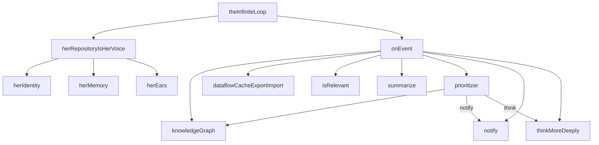
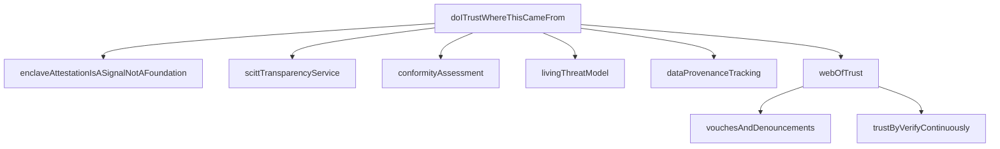
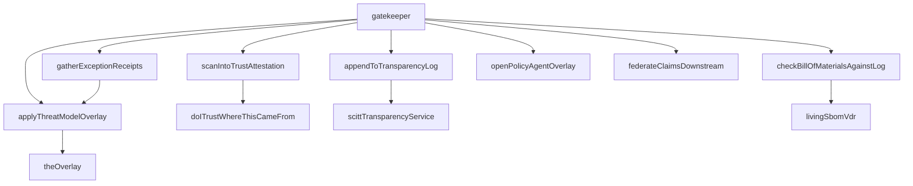
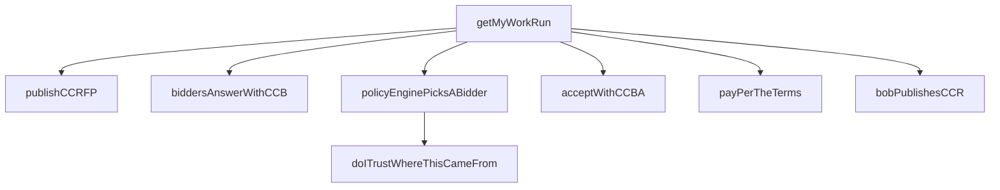
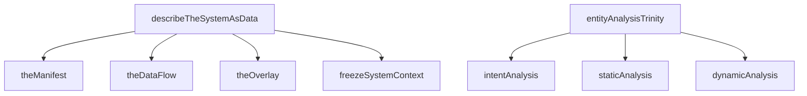
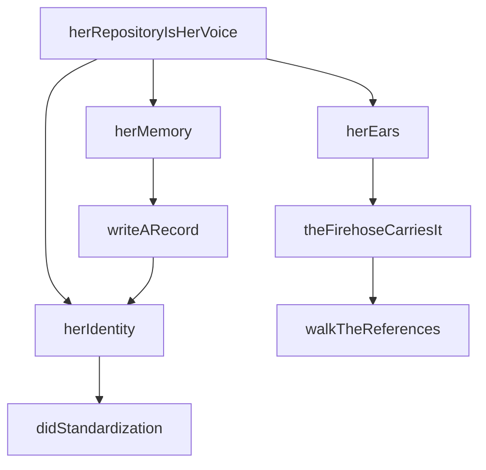

# Open Architecture — Caveman Architecture Report

## State

```
commsProcessed:  691 / 691 (100%)
concepts:        263
stubs:           258
issues:          10
stub rate:       98.1% (258/263)
```

## Package Sizes (symbols)

```
alice-supply-chain            ██████████████████████████████████████████████████████████████████████████████████████████████████████████████████████████ 122
alice-system-context          ████████████████████████████████████████████████ 48
alice-trust                   ██████████████████████████████████████████ 42
alice-stream-of-consciousness █████████████████████████████████ 33
alice-communication           ████████████████████████████████ 32
alice-compute-contract        ████████████████████ 19
alice                         ████████████████████ 19
alice-common                  ██████████████ 14
```

## Batch History

```
Batch 1:  3 concepts,  79.4s,  3 new,  0 refined,  1 attempt
Batch 2:  6 concepts,  95.7s,  6 new,  0 refined,  1 attempt
Batch 3:  0 concepts,  null,   0 new,  0 refined,  2 attempts  ← FAILED
─────────────────────────────────────────────────────────────
Total:    9 concepts across 2 good batches + 1 dead batch
```

Batch 3 failed. 2 attempts, 0 concepts found, null elapsed. Suggests
process-eng-comms.ts agent hit wall — all remaining comms too novel or
agent context exhausted.

## Dep Graph (ABC layers)

```
lib/common/alice-common (14 types, no project-local imports)
  ↑
  ├── lib/abc/alice-trust (42)
  ├── lib/abc/alice-communication (32)
  ├── lib/abc/alice-compute-contract (19)
  ├── lib/abc/alice-supply-chain (122)
  ├── lib/abc/alice-system-context (48)
  ├── lib/abc/alice-stream-of-consciousness (33)
  └── lib/abc/alice (19) ← spine, imports all 6 above
```

No cycles. common → abc only. alice spine is sole aggregator.

## SUBSYSTEM 1: puttingItTogether — Full Loop Spine

```mermaid
graph TD
  PIT[puttingItTogether] --> HRIV[herRepositoryIsHerVoice]
  PIT --> DITWCF[doITrustWhereThisCameFrom]
  PIT --> GK[gatekeeper]
  PIT --> GMWR[getMyWorkRun]
  PIT --> TMD[thinkMoreDeeply]

  HRIV --> HI[herIdentity]
  HRIV --> HM[herMemory]
  HRIV --> HE[herEars]

  HI --> DS[didStandardization]
  HM --> WAR[writeARecord]
  WAR --> HI

  HE --> TFCI[theFirehoseCarriesIt]
  TFCI --> WTR[walkTheReferences]

  DITWCF --> EAIASNAF[enclaveAttestationIsASignalNotAFoundation]
  DITWCF --> STS[scittTransparencyService]
  DITWCF --> CA[conformityAssessment]
  DITWCF --> LTM[livingThreatModel]
  DITWCF --> DPT[dataProvenanceTracking]
  DITWCF --> WOT[webOfTrust]
  WOT --> VAD[vouchesAndDenouncements]
  WOT --> TBVC[trustByVerifyContinuously]

  GK --> SITA[scanIntoTrustAttestation]
  GK --> ATL[appendToTransparencyLog]
  GK --> CBOMAL[checkBillOfMaterialsAgainstLog]
  GK --> GER[gatherExceptionReceipts]
  GK --> OPAO[openPolicyAgentOverlay]
  GK --> ATMO[applyThreatModelOverlay]
  GK --> FCD[federateClaimsDownstream]

  SITA --> DITWCF
  ATL --> STS
  CBOMAL --> LSVDR[livingSbomVdr]
  GER --> ATMO
  ATMO --> TO[theOverlay]

  GMWR --> PCCRFP[publishCCRFP]
  GMWR --> BAWCCB[biddersAnswerWithCCB]
  GMWR --> PEPAB[policyEnginePicksABidder]
  GMWR --> AWCCBA[acceptWithCCBA]
  GMWR --> PPTT[payPerTheTerms]
  GMWR --> BPCCR[bobPublishesCCR]

  PEPAB --> DITWCF

  TMD --> EAT[entityAnalysisTrinity]
  EAT --> IA[intentAnalysis]
  EAT --> SA[staticAnalysis]
  EAT --> DA[dynamicAnalysis]
```



Text tree:

```
puttingItTogether(buildEvent)
 ├─ herRepositoryIsHerVoice()
 │   ├─ herIdentity() → didStandardization()
 │   ├─ herMemory() → writeARecord() → herIdentity()
 │   └─ herEars() → theFirehoseCarriesIt() → walkTheReferences()
 ├─ doITrustWhereThisCameFrom(source)
 │   ├─ enclaveAttestationIsASignalNotAFoundation()
 │   ├─ scittTransparencyService()
 │   ├─ conformityAssessment()
 │   ├─ livingThreatModel()
 │   ├─ dataProvenanceTracking()
 │   └─ webOfTrust(operator)
 │       ├─ vouchesAndDenouncements(operator)
 │       └─ trustByVerifyContinuously()
 ├─ gatekeeper(component)
 │   ├─ scanIntoTrustAttestation(component) → doITrustWhereThisCameFrom()
 │   ├─ appendToTransparencyLog(attestation) → scittTransparencyService()
 │   ├─ checkBillOfMaterialsAgainstLog(component) → livingSbomVdr()
 │   ├─ [if !check] gatherExceptionReceipts() → applyThreatModelOverlay()
 │   ├─ openPolicyAgentOverlay()
 │   ├─ applyThreatModelOverlay() → theOverlay()
 │   └─ federateClaimsDownstream()
 ├─ getMyWorkRun()
 │   ├─ publishCCRFP() → CCRFP
 │   ├─ biddersAnswerWithCCB(rfp) → CCB[]
 │   ├─ policyEnginePicksABidder(bids) → doITrustWhereThisCameFrom()
 │   ├─ acceptWithCCBA(chosen) → CCBA
 │   ├─ payPerTheTerms(accept)
 │   └─ bobPublishesCCR(accept) → CCR
 └─ thinkMoreDeeply()
     └─ entityAnalysisTrinity()
         ├─ intentAnalysis()
         ├─ staticAnalysis()
         └─ dynamicAnalysis()
```

## SUBSYSTEM 2: theInfiniteLoop + onEvent — Runtime



Text tree:

```
theInfiniteLoop(event)
 ├─ herRepositoryIsHerVoice()
 │   ├─ herIdentity()
 │   ├─ herMemory()
 │   └─ herEars()
 └─ onEvent(event)
     ├─ knowledgeGraph(event)
     ├─ dataflowCacheExportImport()
     ├─ isRelevant(event) → false (stub, always false)
     ├─ summarize(event) → undefined (stub)
     ├─ prioritizer(changes) → "think" (always)
     │   └─ knowledgeGraph(changes)
     └─ thinkMoreDeeply() [if not "notify"]
         └─ entityAnalysisTrinity()
```

Current behavior: isRelevant always false → no event ever triggers notify/think.
Prioritizer always returns "think" if reached. Summary always undefined.

## SUBSYSTEM 3: doITrustWhereThisCameFrom — Trust



Text tree:

```
doITrustWhereThisCameFrom(source: DID) → boolean
 ├─ enclaveAttestationIsASignalNotAFoundation()     [stub]
 ├─ scittTransparencyService()                      [stub]
 ├─ conformityAssessment()                          [stub]
 ├─ livingThreatModel()                             [stub]
 ├─ dataProvenanceTracking()                        [stub]
 └─ webOfTrust(operator: DID) → true (always)
     ├─ vouchesAndDenouncements(operator)            [stub]
     └─ trustByVerifyContinuously()                  [stub]
```

All trust checks pass. webOfTrust always true. Enclave attestation called but
result discarded — signal only, never foundation. 42 symbols in alice-trust,
most extending core trust with KERI, DICE, OIDC, SCITT auth, jury-duty review,
CISA self-attestation, etc.

## SUBSYSTEM 4: gatekeeper — Supply Chain



Text tree:

```
gatekeeper(component: StrongRef)
 ├─ scanIntoTrustAttestation(component) → StrongRef
 │   └─ doITrustWhereThisCameFrom("did:plc:")
 ├─ appendToTransparencyLog(attestation)
 │   └─ scittTransparencyService()
 ├─ checkBillOfMaterialsAgainstLog(component) → true
 │   └─ livingSbomVdr()
 ├─ [if !check] gatherExceptionReceipts(component)
 │   └─ applyThreatModelOverlay() → theOverlay()
 ├─ openPolicyAgentOverlay()      [stub: OPA → JSON → DID/VC/SCITT]
 ├─ applyThreatModelOverlay()
 │   └─ theOverlay()              [stub: empty overlay]
 └─ federateClaimsDownstream()    [stub: provenance intact downstream]
```

122 symbols in alice-supply-chain — largest package. Core gatekeeper (7 fns)
extended by ~115 stubs covering: secure software factory, SCITT notary registry,
shouldi contribute pipeline, container registry on-demand, threat-model-as-gate,
CSAF/VEX framework, ATP-SCITT integration, DWN federation, ActivityPub-SCITT
handshake, deployment-driven exploitability, FROM rebuild chains, + more.

## SUBSYSTEM 5: getMyWorkRun — Compute Contracts



Text tree:

```
getMyWorkRun() → CCR
 ├─ publishCCRFP() → CCRFP { request: empty manifest }
 ├─ biddersAnswerWithCCB(rfp) → CCB[]  [stub: empty array]
 ├─ policyEnginePicksABidder(bids) → CCB
 │   └─ bids.filter(bid => doITrustWhereThisCameFrom(bid.bidder))
 ├─ acceptWithCCBA(chosen) → CCBA
 ├─ payPerTheTerms(accept)              [stub: receipts are currency]
 └─ bobPublishesCCR(accept) → CCR
     { chain: { request, bid, accept }, evidence: undefined }
```

6-step lifecycle: RFP → Bid → Pick → Accept → Pay → Receipt.
Types: CCRFP, CCB, CCBA, CCR in alice-common. Policy engine picks
bidder by filtering through doITrustWhereThisCameFrom.

## SUBSYSTEM 6: entityAnalysisTrinity + describeTheSystemAsData



Text tree:

```
describeTheSystemAsData() → SystemContext
 ├─ theManifest() → { intent: "", schema: undefined, data: undefined }
 ├─ theDataFlow() → { operations: {}, links: [] }
 ├─ theOverlay() → { context: "", patch: undefined }
 └─ freezeSystemContext(manifest, overlays, dataflow)
     → { upstream, overlays: [overlay], orchestrator }

entityAnalysisTrinity() → EntityAnalysisTrinity
 ├─ intentAnalysis() → undefined          [stub]
 ├─ staticAnalysis() → undefined          [stub]
 └─ dynamicAnalysis() → undefined         [stub]
```

Manifest = what (intent + schema + data).
DataFlow = how (operations graph + strong ref links).
Overlay = in what context (policy, deployment, threat model).
SystemContext = manifest + overlays + dataflow frozen for one execution = one
Thought.
EntityAnalysisTrinity = intent + static + dynamic corners. All return undefined.

## SUBSYSTEM 7: herRepositoryIsHerVoice — Communication



Text tree:

```
herRepositoryIsHerVoice()
 ├─ herIdentity() → DID "did:plc:"
 │   └─ didStandardization()  [stub: DID 1.0 W3C Rec July 2022]
 ├─ herMemory()
 │   └─ writeARecord() → RepoRecord { uri, cid, author: herIdentity() }
 └─ herEars()
     └─ theFirehoseCarriesIt()
         └─ walkTheReferences() → StrongRef { uri: "at://", cid: "" }
```

Identity = DID (did:plc:). Memory = PDS repo (write records). Ears = firehose
(walk strong references). Record = at:// URI + CID + author DID + value.
Walk references = walk reasoning.

## Import Map

```
alice-common ← types only, no project-local imports
  ↑
  ├── alice-trust
  │     imports: { DID } from common
  │
  ├── alice-communication
  │     imports: { DID, StrongRef, RepoRecord } from common
  │
  ├── alice-compute-contract
  │     imports: { DID, CCB, CCBA, CCR, CCRFP } from common
  │     imports: { doITrustWhereThisCameFrom } from trust
  │
  ├── alice-supply-chain
  │     imports: { StrongRef } from common
  │     imports: { doITrustWhereThisCameFrom, scittTransparencyService }
  │              from trust
  │     imports: { theOverlay } from system-context
  │
  ├── alice-system-context
  │     imports: { DataFlow, EntityAnalysisTrinity, Manifest, Overlay,
  │               SystemContext } from common
  │
  ├── alice-stream-of-consciousness
  │     imports: { SystemContext } from common
  │     imports: { entityAnalysisTrinity, hypothesizeSystemContext }
  │              from system-context
  │
  └── alice (spine, imports all 6 abc packages)
        imports: { herRepositoryIsHerVoice } from communication
        imports: { doITrustWhereThisCameFrom } from trust
        imports: { getMyWorkRun } from compute-contract
        imports: { gatekeeper } from supply-chain
        imports: { onEvent, thinkMoreDeeply } from stream-of-consciousness
        imports: { describeTheSystemAsData } from system-context
```

No cycles. Arrow: common ← abc ← (alice spine). alice never imported by
any package. supply-chain imports trust + system-context. compute-contract
imports trust. stream-of-consciousness imports system-context.

## Stub Coverage

```
Total concepts:  263
Stubs:           258
Implemented:     5
Stub rate:       98.1%

Implemented fns:
  puttingItTogether     — full call dispatch, all sub-fns are stubs
  doITrustWhereThisCameFrom — full call dispatch, webOfTrust always true
  gatekeeper            — full call dispatch, checkBOM always true
  getMyWorkRun          — full call dispatch, empty bids, dummy CCR
  onEvent               — full call dispatch, isRelevant always false

Stub shape:
  Body = empty, returns undefined, or returns hardcoded default.
  JSDoc = prose from open_architecture_today.md.
  Each stub maps to ≥1 engineering comm (from 691 total).
  process-eng-comms.ts reads comms, spawns alice-eng-comms agent,
  agent writes stub function per concept.
```

## Issues

```
10 active issues. Stubs = placeholders for 258 unwired concepts.
Each stub becomes real when implementation connects it to I/O layer
(Deno, fetch, WebSocket, crypto). Current architecture = interface
layer only (lib/abc). No impl, factory, or CLI packages exist yet
for alice concepts.
```

## Process

```
691 engineering discussion logs (comms/)
  → process-eng-comms.ts reads each comm
  → spawns alice-eng-comms agent (.claude/agents/)
  → agent writes stub function in correct abc package
  → stub has JSDoc from source doc + empty body
  → related concepts listed in comment

Result: 263 concepts, 258 stubs, 5 wired call graphs.
9 concepts discovered across 2 successful batches (batch 3 failed).
Batch 1: 79.4s for 3 concepts. Batch 2: 95.7s for 6 concepts.
Agent throughput: ~26-37s per concept in successful batches.
```
