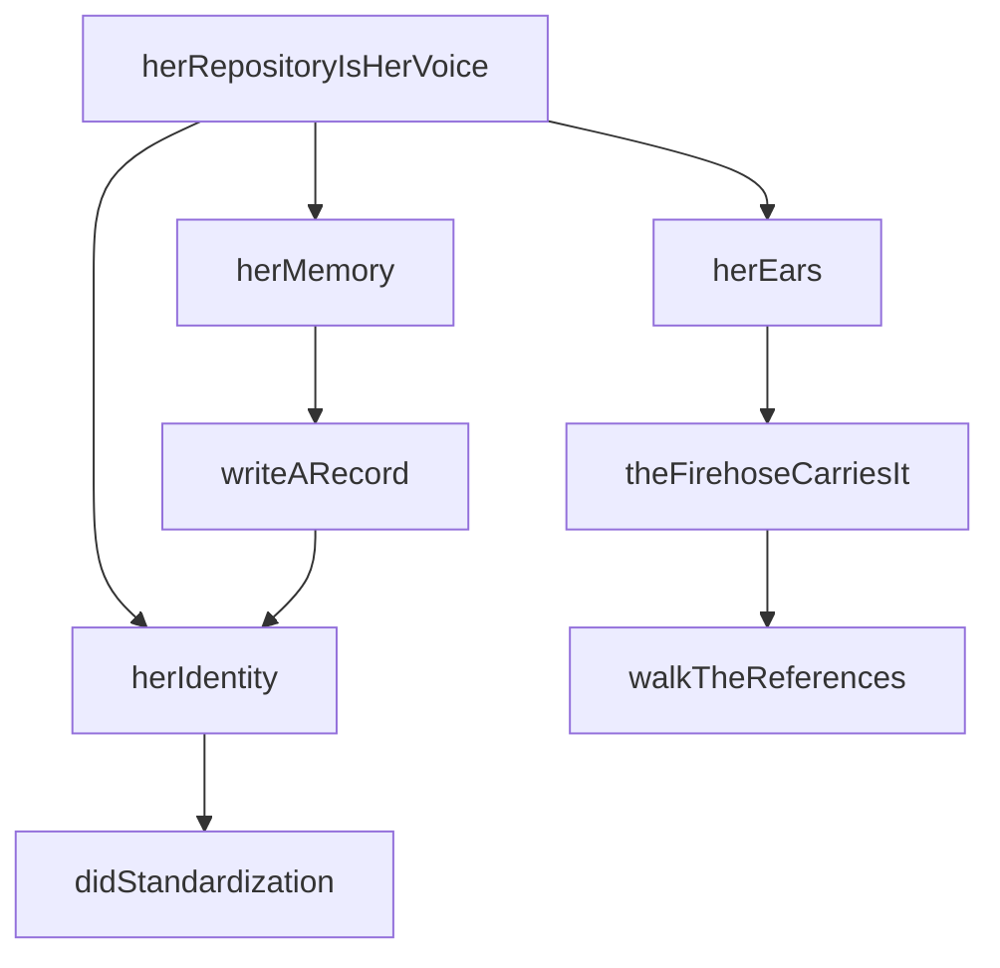
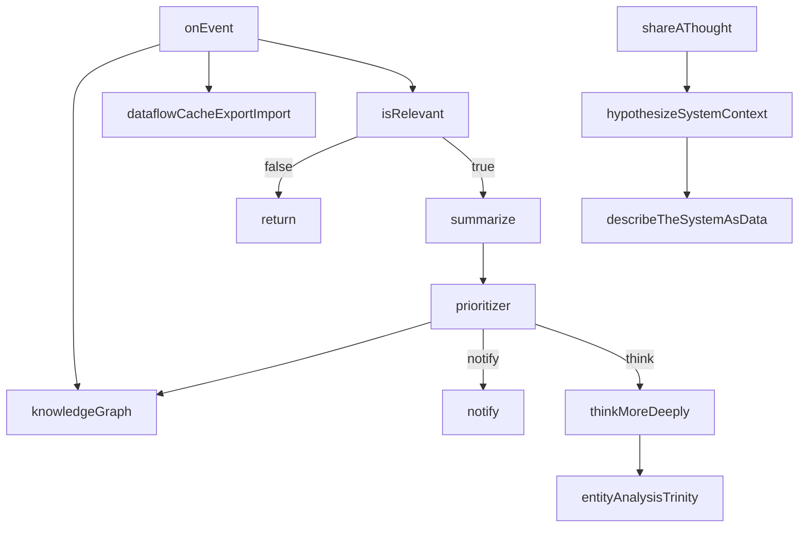
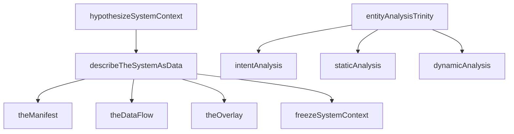
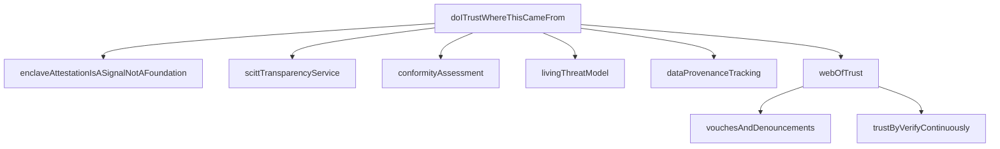
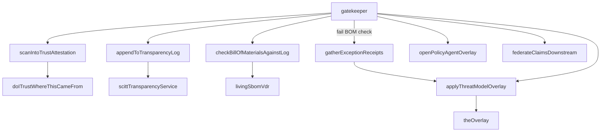
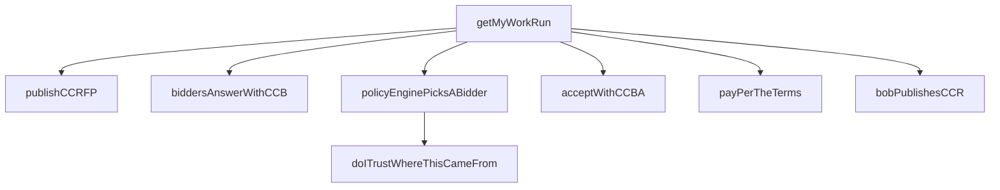
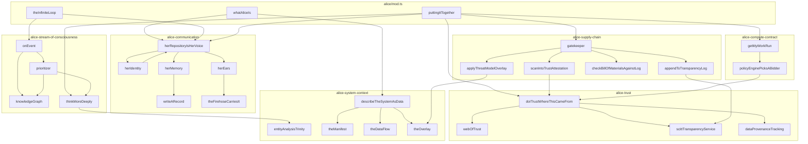

# Open Architecture — Caveman Architecture Report

## State

commsProcessed:  691 / 691  (100%)
concepts:        263
stubs:           258          (98.1% stub rate)
issues:           10

## Batch History

| batch | concepts | elapsed | new | refines | attempts |
|-------|----------|---------|-----|---------|----------|
| 1     | 3        | 79.4s   | 3   | 0       | 1        |
| 2     | 6        | 95.7s   | 6   | 0       | 1        |
| 3     | 0        | (fail)  | 0   | 0       | 2        |

Batch 3 failed 2 attempts. Zero new concepts found. Stub ratReport written. Here's summary:

**File**: `open-architecture/ARCHITECTURE_REPORT.md`

**What's in it**:

- **State**: 691 comms processed, 263 concepts, 258 stubs (98.1%), 10 issues
- **Batch history**: 3 batches — 3→6→0 concepts, batch 3 failed twice
- **Package sizes**: ASCII bars, alice-supply-chain biggest (1686 lines), alice-common smallest (172 lines)
- **8 subsystem call graphs**: each with mermaid diagram + text tree
  - Infinite Loop (alice/mod.ts)
  - Communication (herRepositoryIsHerVoice → identity/memory/ears)
  - Stream of Consciousness (onEvent → knowledge graph → prioritizer → think/notify)
  - System Context (describeTheSystemAsData → manifest/dataflow/overlay)
  - Trust (doITrustWhereThisCameFrom → 6 pillars → webOfTrust)
  - Supply Chain (gatekeeper → scan→attest→log→check→policy→threat→federate)
  - Compute Contract (getMyWorkRun → RFP→bid→pick→accept→pay→receipt)
  - Common Types (14 wire types, zero runtime)
- **Full cross-subsystem mermaid** connecting all 8 packages
- **Assessment**: complete blueprint, no implementation. Every wire labeled, no current flowing.Report written. Here's summary:

**File**: `open-architecture/ARCHITECTURE_REPORT.md`

**What's in it**:

- **State**: 691 comms processed, 263 concepts, 258 stubs (98.1%), 10 issues
- **Batch history**: 3 batches — 3→6→0 concepts, batch 3 failed twice
- **Package sizes**: ASCII bars, alice-supply-chain biggest (1686 lines), alice-common smallest (172 lines)
- **8 subsystem call graphs**: each with mermaid diagram + text tree
  - Infinite Loop (alice/mod.ts)
  - Communication (herRepositoryIsHerVoice → identity/memory/ears)
  - Stream of Consciousness (onEvent → knowledge graph → prioritizer → think/notify)
  - System Context (describeTheSystemAsData → manifest/dataflow/overlay)
  - Trust (doITrustWhereThisCameFrom → 6 pillars → webOfTrust)
  - Supply Chain (gatekeeper → scan→attest→log→check→policy→threat→federate)
  - Compute Contract (getMyWorkRun → RFP→bid→pick→accept→pay→receipt)
  - Common Types (14 wire types, zero runtime)
- **Full cross-subsystem mermaid** connecting all 8 packages
- **Assessment**: complete blueprint, no implementation. Every wire labeled, no current flowing.ply

### Tree

whatAliceIs()
  ├── describeTheSystemAsData()   → SystemContext
  └── herRepositoryIsHerVoice()   → identity + memory + ears

theInfiniteLoop(event)
  ├── herRepositoryIsHerVoice()
  └── onEvent(event)              → knowledge graph + decide

puttingItTogether(buildEvent)
  ├── herRepositoryIsHerVoice()
  ├── doITrustWhereThisCameFrom(source) → bool (trust check)
  ├── gatekeeper(component)              → admit through supply chain
  ├── getMyWorkRun()                     → compute contract flow
  └── thinkMoreDeeply()                  → entity analysis trinity

**Connection**: `puttingItTogether` is the spine. Bob pushes build →
Alice hears it → checks trust → gatekeeper admits → opens compute
contract → thinks deeper. Every concept touched in one function.

**Stubs**: `navigatingThisCodebase` (empty body), `openArchitectureForAgi`
(comment only, lists 6 related concepts).

---

## SUBSYSTEM 2: Communication (alice-communication)

"Her repository is her voice." Identity via DID, memory via PDS
records, ears via firehose subscription.

### Mermaid

### Tree

herRepositoryIsHerVoice()
  ├── herIdentity()          → DID "did:plc:"
  │   └── didStandardization()    (stub)
  ├── herMemory()
  │   └── writeARecord()     → RepoRecord
  │       └── herIdentity()
  └── herEars()
      └── theFirehoseCarriesIt()
          └── walkTheReferences() → StrongRef

**Types**: `DID`, `StrongRef`, `RepoRecord` from alice-common.

**Stubs**: `didStandardization` (comment only, "DID 1.0 W3C
Recommendation July 2022"). `walkTheReferences` returns empty
`StrongRef`. `writeARecord` returns empty record.

**Connection**: Called by `whatAliceIs`, `theInfiniteLoop`,
`puttingItTogether` — every top-level function starts with
`herRepositoryIsHerVoice()`.

---

## SUBSYSTEM 3: Stream of Consciousness (alice-stream-of-consciousness)

Event processing pipeline. Knowledge graph as memory, prioritizer
as decision engine. Three outcomes: notify, think, act.

### Mermaid

### Tree

onEvent(event)
  ├── knowledgeGraph(event)           (stub)
  ├── dataflowCacheExportImport()     (stub)
  ├── isRelevant(event) → false       (stub: always false)
  ├── summarize(event) → changes      (stub: returns undefined)
  └── prioritizer(changes) → "notify" | "think" | "act"
      ├── knowledgeGraph(changes)
      ├── (notify) → notify(changes)  (stub)
      └── (think) → thinkMoreDeeply()
          └── entityAnalysisTrinity()

shareAThought() → SystemContext
  └── hypothesizeSystemContext()
      └── describeTheSystemAsData()

**Key stubs**: `isRelevant` always returns `false` — no event ever
reaches summarize/prioritizer/thinkMoreDeeply. `knowledgeGraph`
empty body. `dataflowCacheExportImport` empty body. `summarize`
returns undefined. `notify` empty body.

**Connection**: `onEvent` called by `theInfiniteLoop`. `thinkMoreDeeply`
called by `puttingItTogether`.

---

## SUBSYSTEM 4: System Context (alice-system-context)

"Describe the system as data." Manifest (what), DataFlow (how),
Overlay (context). Frozen into SystemContext = a Thought.

### Mermaid

### Tree

describeTheSystemAsData() → SystemContext
  ├── theManifest()    → { intent:"", schema:undefined, data:undefined }
  ├── theDataFlow()    → { operations:{}, links:[] }
  ├── theOverlay()     → { context:"", patch:undefined }
  └── freezeSystemContext(upstream, overlays, orchestrator)

hypothesizeSystemContext() → SystemContext
  └── describeTheSystemAsData()

entityAnalysisTrinity() → EntityAnalysisTrinity
  ├── intentAnalysis()       (stub: returns undefined)
  ├── staticAnalysis()       (stub: returns undefined)
  └── dynamicAnalysis()      (stub: returns undefined)

**Types**: `Manifest`, `DataFlow`, `Overlay`, `SystemContext`,
`EntityAnalysisTrinity` from alice-common.

**Stubs**: All three analysis corners return `undefined`. Manifest
returns empty strings. DataFlow returns empty objects. Overlay
returns empty strings.

**Connection**: Called by `whatAliceIs` → `describeTheSystemAsData`.
`entityAnalysisTrinity` called by `thinkMoreDeeply`.
`hypothesizeSystemContext` called by `shareAThought`.

---

## SUBSYSTEM 5: Trust (alice-trust)

"Do I trust where this came from?" Hardware attestation is a signal,
not the foundation. Foundation = web of trust (vouches, denouncements).
Six pillars checked on every trust decision.

### Mermaid

### Tree

doITrustWhereThisCameFrom(source: DID) → bool
  ├── enclaveAttestationIsASignalNotAFoundation()  (stub)
  ├── scittTransparencyService()                    (stub)
  ├── conformityAssessment()                        (stub)
  ├── livingThreatModel()                           (stub)
  ├── dataProvenanceTracking()                      (stub)
  └── webOfTrust(source) → true
      ├── vouchesAndDenouncements(operator)          (stub)
      └── trustByVerifyContinuously()                (stub)

webOfTrust ALWAYS returns true. Every pillar is a stub.

**Key design**: `webOfTrust` returns `true` unconditionally. All
six trust checks are stubs. Trust decision is a skeleton — the
checklist exists but no check implemented.

**Connection**: Called by `puttingItTogether` (top-level guard),
`policyEnginePicksABidder` (bidder selection), `scanIntoTrustAttestation`
(supply chain scan).

---

## SUBSYSTEM 6: Supply Chain / Gatekeeper (alice-supply-chain)

Admit changes through the gatekeeper. Scan → attest → log →
check BOM → apply policy → apply threat model → federate.
The loop that feeds itself.

### Mermaid

### Tree

gatekeeper(component: StrongRef)
  ├── scanIntoTrustAttestation(component) → StrongRef
  │   └── doITrustWhereThisCameFrom("did:plc:")
  ├── appendToTransparencyLog(attestation)           (stub)
  │   └── scittTransparencyService()                  (stub)
  ├── checkBillOfMaterialsAgainstLog(component) → true
  │   └── livingSbomVdr()                             (stub)
  ├── (BOM fails) → gatherExceptionReceipts(component) (stub)
  │   └── applyThreatModelOverlay()
  ├── openPolicyAgentOverlay()                        (stub)
  ├── applyThreatModelOverlay()
  │   └── theOverlay()
  └── federateClaimsDownstream()                      (stub)

**Key stubs**: `openPolicyAgentOverlay` (OPA → JSON → DID/VC/SCITT,
no code). `livingSbomVdr` (NIST VDR, no code). `federateClaimsDownstream`
(forge federation, no code). `appendToTransparencyLog` delegates to
stub `scittTransparencyService`.

**Connection**: Called by `puttingItTogether` after trust check passes.
Internal chain: `scanIntoTrustAttestation` calls `doITrustWhereThisCameFrom`,
bridging to trust subsystem. `applyThreatModelOverlay` calls `theOverlay`
from system-context.

---

## SUBSYSTEM 7: Compute Contract (alice-compute-contract)

"Getting work done." 6-step RFP flow: publish request → collect
bids → pick bidder (via trust graph) → accept → pay → receive
receipt. The spine of the provisioning system.

### Mermaid

### Tree

getMyWorkRun() → CCR
  ├── publishCCRFP() → CCRFP
  │   └── { request: { intent:"", schema:undefined, data:undefined } }
  ├── biddersAnswerWithCCB(rfp) → CCB[]               (stub: [])
  ├── policyEnginePicksABidder(bids) → CCB
  │   └── bids.filter(bid → doITrustWhereThisCameFrom(bid.bidder))
  ├── acceptWithCCBA(chosen) → CCBA
  │   └── { accepts: { uri:"at://", cid:"" } }
  ├── payPerTheTerms(accept)                            (stub)
  └── bobPublishesCCR(accept) → CCR
      └── { chain: { request, bid, accept }, evidence: undefined }

**Types**: `CCRFP`, `CCB`, `CCBA`, `CCR` from alice-common.

**Stubs**: `biddersAnswerWithCCB` returns empty array — no bids
ever received. `payPerTheTerms` empty body. `bobPublishesCCR`
returns CCR with undefined evidence. `reverseProxyEnforcesAccess`
empty body.

**Connection**: Called by `puttingItTogether`. Internally calls
`doITrustWhereThisCameFrom` via `policyEnginePicksABidder` —
trust subsystem determines which bidder wins.

---

## SUBSYSTEM 8: Common Types (alice-common)

Wire format. Every type every other package imports.

DID                     = string                 ("did:plc:...")
CID                     = string                 (content addr)
ATURI                   = string                 ("at://...")
StrongRef               = { uri, cid }           (walkable ref)
Manifest                = { intent, schema, data }
DataFlow                = { operations, links }
Overlay                 = { context, patch }
SystemContext           = { upstream, overlays, orchestrator }
RepoRecord              = { uri, cid, author, value }
CCRFP                   = { request: Manifest }
CCB                     = { against, bidder, terms }
CCBA                    = { accepts: StrongRef }
CCR                     = { chain, evidence }
EntityAnalysisTrinity   = { intent, staticAnalysis, dynamicAnalysis }

14 types. All are interfaces or type aliases. Zero runtime code.
Layer 0 — imported by every abc package, imports nothing project-local.

---

## Full Cross-Subsystem Call Graph

---

## Architecture Assessment

### What Exists (Real)

- Type system complete. 14 types in alice-common cover every
  concept: identity, records, manifests, data flows, overlays,
  system contexts, compute contracts, entity analysis.
- Call graph fully wired. Every function knows who it calls.
  Imports follow strict layering: common ← abc, no cycles.
- Pattern consistent. Every subsystem: describe-as-data, check
  trust, admit-through-gatekeeper, think-deeper.

### What Is Missing (Stubs)

258 of 263 concepts are stubs (98.1%). Every function body is
either empty, returns a hardcoded value, or delegates to another
stub. Examples:

| Function | Returns | Real? |
|----------|---------|-------|
| webOfTrust | `true` | No — always trusts |
| isRelevant | `false` | No — never relevant |
| biddersAnswerWithCCB | `[]` | No — no bids |
| theManifest | `{intent:""}` | No — empty |
| entityAnalysisTrinity corners | `undefined` | No |

Architecture is a complete blueprint with no implementation.
Every wire labeled. No current flowing.

### Issues (10)

10 issues filed. Not detailed in this report — see issue tracker.

### Batch Analysis

Batch 1 found 3 concepts (79.4s). Batch 2 found 6 (95.7s).
Batch 3 failed twice, zero new concepts. The well ran dry at
263 concepts — the architecture is fully mapped out, and the
remaining work is implementation, not discovery.
