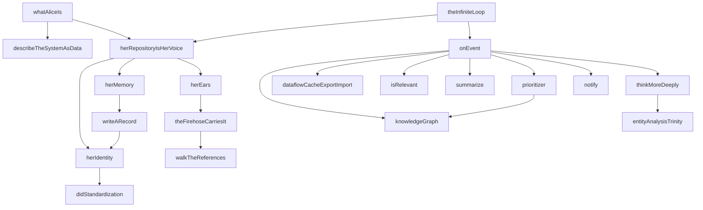
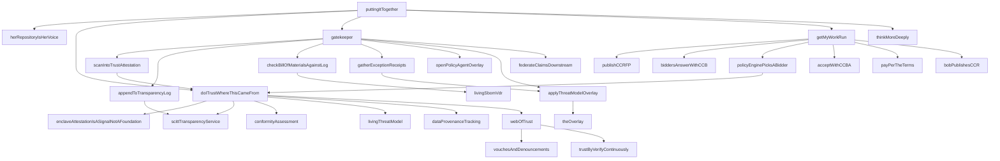
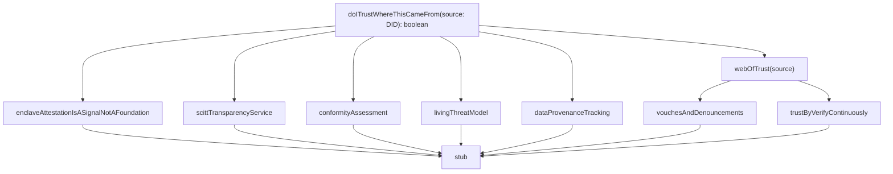
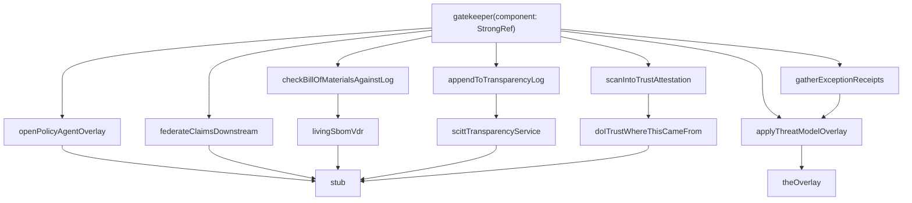
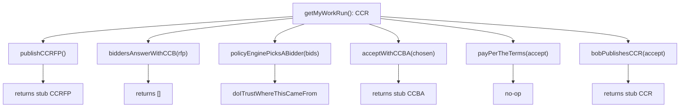
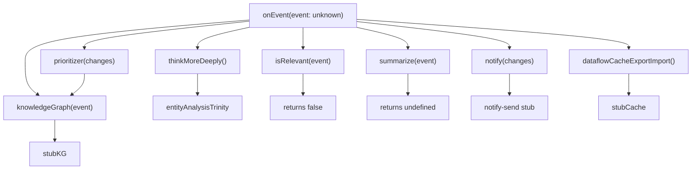
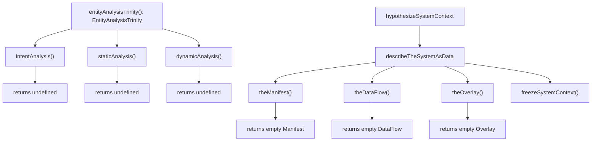
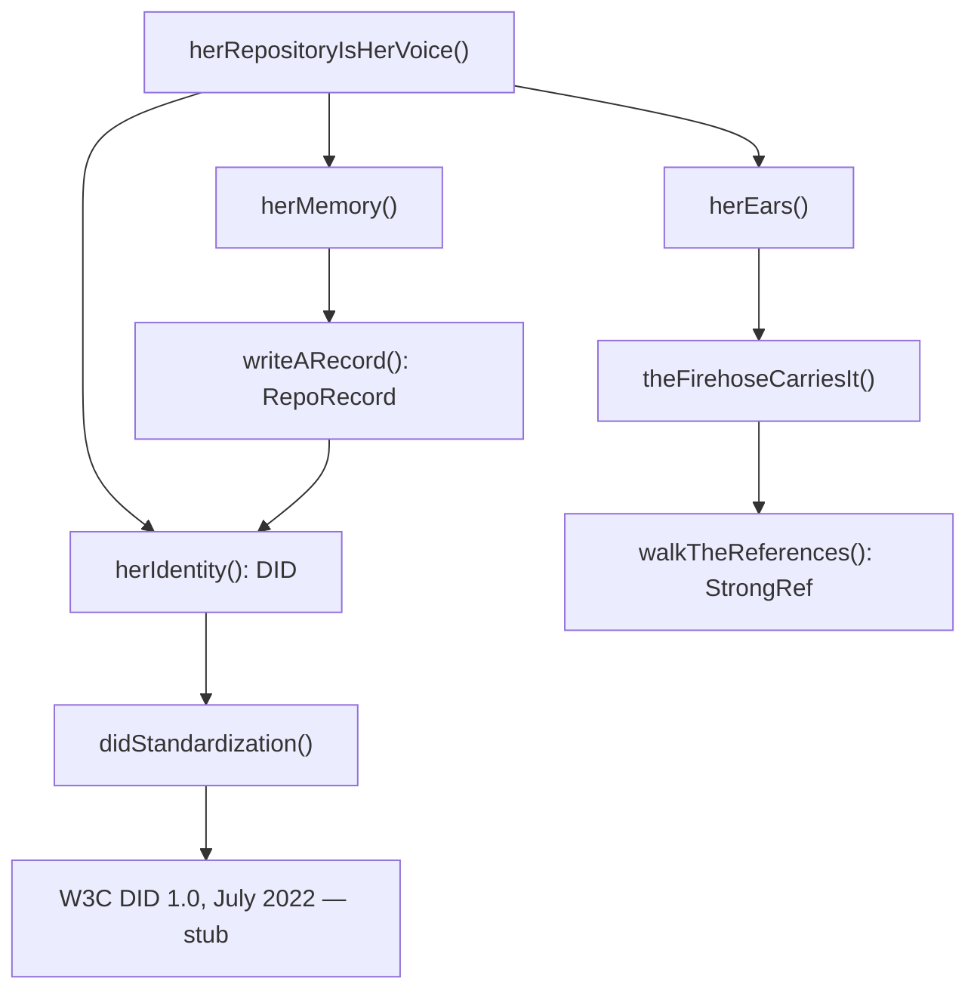

# Alice Open Architecture — Caveman Report

## State

```
commsProcessed:  144 / 691  (20.8%)
concepts:         92
stubs:            87  (94.6% of concepts are stubs)
issues:            9
```

94.6% stub rate — architecture is docs-as-code skeleton. 87 of 92
concepts have empty function bodies. Real implementation in hono-pds
and atproto-market (separate repos). This repo is the blueprint.

## Package sizes

```
alice-system-context  ███████████████████████████████████ 35 files
alice-supply-chain    ████████████████████████████████   32 files
alice-trust           ██████████████████                 18 files
alice-stream-of-...   █████████████████                  17 files
alice-common          ██████████████                     14 files
alice                 ████████████                       12 files
alice-compute-contract ███████████                       11 files
alice-communication   ██████████                         10 files
                                           total:       149 files
```

## Batch history

| Batch | Concepts | Elapsed | New | Refined | Attempts |
|-------|----------|---------|-----|---------|----------|
| 1     | 2        | 69.9s   | 0   | 2       | 2        |
| 2     | 4        | 115.1s  | 4   | 0       | 2        |

Batch 1: refinement-only pass (both concepts already known).
Batch 2: 4 new concepts discovered, no refinement needed.
Avg: 92.5s per batch. 2 attempts per batch = retry on failure.

## Topology

All ABC layer (lib/abc/alice*/mod.ts). Zero impl, zero factory,
zero CLI. This repo is pure architecture — the blueprint layer.

Each concept splits into its own package. alice/mod.ts is the
orchestrator importing from sibling abc packages:

```
alice/mod.ts
  imports from:
    @publicdomainrelay/alice-communication-abc
    @publicdomainrelay/alice-trust-abc
    @publicdomainrelay/alice-compute-contract-abc
    @publicdomainrelay/alice-supply-chain-abc
    @publicdomainrelay/alice-stream-of-consciousness-abc
    @publicdomainrelay/alice-system-context-abc
  depends on:
    @publicdomainrelay/alice-common  (types)
```

Dep arrow: alice-common ← all abc packages. No cycles.

---

# SUBSYSTEM 1: whatAliceIs / theInfiniteLoop

Root entrypoints. whatAliceIs describes the system. theInfiniteLoop
is the forever-loop: hear thought → decide → act → repeat.

## Call graph (mermaid)



## Text tree

```
whatAliceIs
  describeTheSystemAsData
    theManifest → stub
    theDataFlow → stub
    theOverlay → stub
    freezeSystemContext → constructs SystemContext object
  herRepositoryIsHerVoice
    herIdentity → didStandardization (W3C DID 1.0, July 2022)
    herMemory → writeARecord → herIdentity
    herEars → theFirehoseCarriesIt → walkTheReferences

theInfiniteLoop(event)
  herRepositoryIsHerVoice
  onEvent(event)
    knowledgeGraph(event)
    dataflowCacheExportImport → stub
    isRelevant(event) → hardcoded false (stub)
    summarize(event) → stub
    prioritizer(changes) → knowledgeGraph, returns "think"
    notify(changes) → stub
    thinkMoreDeeply → entityAnalysisTrinity
```

---

# SUBSYSTEM 2: puttingItTogether

Full end-to-end flow. Bob pushes build → Alice hears → trust check →
gatekeeper → compute contract → deep think.

## Call graph (mermaid)



## Text tree

```
puttingItTogether(buildEvent: { source: DID })
  herRepositoryIsHerVoice()
  if !doITrustWhereThisCameFrom(buildEvent.source) → return (abort)
  gatekeeper({ uri: "at://", cid: "" })
    scanIntoTrustAttestation(component)
      doITrustWhereThisCameFrom("did:plc:")  ← hardcoded, stub
      returns component
    appendToTransparencyLog(attestation)
      scittTransparencyService → stub
    checkBillOfMaterialsAgainstLog(component)
      livingSbomVdr → stub
      returns true (always passes)
    if !check → gatherExceptionReceipts(component)
      applyThreatModelOverlay
    openPolicyAgentOverlay → stub
    applyThreatModelOverlay → theOverlay → stub
    federateClaimsDownstream → stub
  getMyWorkRun()
    publishCCRFP → returns stub CCRFP
    biddersAnswerWithCCB(rfp) → returns [] (stub)
    policyEnginePicksABidder(bids)
      filter by doITrustWhereThisCameFrom(bid.bidder)
      returns first trusted, else first bid
    acceptWithCCBA(chosen) → returns stub CCBA
    payPerTheTerms(accept) → stub
    bobPublishesCCR(accept) → returns stub CCR
  thinkMoreDeeply → entityAnalysisTrinity
```

---

# SUBSYSTEM 3: doITrustWhereThisCameFrom (trust)

Weighted multi-signal trust model. Hardware attestation is a signal,
never the foundation. Foundation is web of trust: vouches +
denouncements over time, verified continuously.

## Call graph (mermaid)



## Text tree

```
doITrustWhereThisCameFrom(source: DID): boolean
  enclaveAttestationIsASignalNotAFoundation → stub
    "TEE attestation is a signal, never foundation"
    Ref: tee.fail — memory bus interposition attacks
  scittTransparencyService → stub
    SCITT = Supply Chain Integrity Transparency and Trust
    Content-agnostic. Holds SBOMs, attestations, system contexts.
  conformityAssessment → stub
    ISO/IEC 17000: first/second/third party attestation
    Weighted by web of trust history
  livingThreatModel → stub
    Threats, mitigations, trust boundaries as data
    Evolves with every attestation through gatekeeper
  dataProvenanceTracking → stub
    Provenance on inference ← training data, model env, config
    Feeds prioritizer for intent-based policy
  webOfTrust(operator: DID): boolean
    vouchesAndDenouncements(operator) → stub
    trustByVerifyContinuously → stub
    returns true (always trusts, stub)
```

Trust is 7 parallel signals, ALL stubs. Returns true unconditionally.
Design intent: no single signal is authoritative. Hardware (TEE) is
explicitly demoted — physical access defeats it (tee.fail ref).

---

# SUBSYSTEM 4: gatekeeper (supply chain)

Admission control. Component arrives → scanned into trust attestation →
appended to transparency log → SBOM checked against log → if fail,
exception receipts gathered → OPA overlay → threat model overlay →
federated downstream.

## Call graph (mermaid)



## Text tree

```
gatekeeper(component: StrongRef)
  attestation = scanIntoTrustAttestation(component)
    doITrustWhereThisCameFrom("did:plc:")  ← hardcoded, stub
    returns component (identity transform, stub)
  appendToTransparencyLog(attestation)
    scittTransparencyService → stub
  if !checkBillOfMaterialsAgainstLog(component)
    livingSbomVdr → stub (NIST VDR, SPDX 2.3)
    returns true → never enters exception path (stub)
    gatherExceptionReceipts(component)
      applyThreatModelOverlay
  openPolicyAgentOverlay → stub
    OPA → JSON → DID/VC/SCITT
    Admission policy + evaluation policy
  applyThreatModelOverlay → theOverlay → stub
  federateClaimsDownstream → stub
    "Provenance intact, decision travels to downstream forge"
```

Gatekeeper is linear pipeline. 7 stages, 2 conditional (SBOM check
never fails). All stubs except theOverlay which constructs empty
Overlay object. No actual policy evaluation happens.

---

# SUBSYSTEM 5: getMyWorkRun (compute contracts)

6-step compute contract lifecycle. Alice needs compute → RFP → bids →
policy picks → accept → pay → receipt.

## Call graph (mermaid)



## Text tree

```
getMyWorkRun(): CCR
  rfp = publishCCRFP()
    returns { request: { intent: "", schema: undefined, data: undefined } }
  bids = biddersAnswerWithCCB(rfp)
    returns []  ← no bidders (stub)
  chosen = policyEnginePicksABidder(bids)
    filter bids by doITrustWhereThisCameFrom(bid.bidder)
    returns trusted[0] ?? bids[0]  ← both empty, undefined (stub)
  accept = acceptWithCCBA(chosen)
    returns { accepts: { uri: "at://", cid: "" } }
  payPerTheTerms(accept) → no-op
  return bobPublishesCCR(accept)
    returns { chain: { request, bid, accept: all empty refs }, evidence: undefined }

Also defined (uncalled from getMyWorkRun):
  reverseProxyEnforcesAccess(workload: DID) → stub
    "No standing credentials. Token exchange, role based, least privilege."
  reverseTunnelIsServiceDiscovery → stub
    "Arbitrary compute → HTTPS endpoint via relay."
  headlessScaleToZeroCiRunner → stub
  billOfLadingComputeContract → stub
```

6-step pipeline. All steps return empty stub values. CCR returned
has all StrongRef fields = "at://" / "" (empty). Trust filter on
bidders is the only real logic: `doITrustWhereThisCameFrom` called
per bidder.

---

# SUBSYSTEM 6: onEvent (stream of consciousness)

Event ingest pipeline. Event arrives → knowledge graph → cache
export → relevance filter → summarize → prioritize → notify or
think deeper.

## Call graph (mermaid)



## Text tree

```
onEvent(event: unknown)
  knowledgeGraph(event) → stub
    "What she knows. Each entry carries provenance through inference chain."
  dataflowCacheExportImport() → stub
    "Export orchestrator input network state to pickle/JSON.
     Re-import to resume. GraphQL query of cached state."
  if !isRelevant(event) → return
    isRelevant → returns false (stub, always irrelevant)
  changes = summarize(event) → returns undefined (stub)
  decision = prioritizer(changes)
    knowledgeGraph(changes)
    returns "think" (always, stub)
  if decision === "notify" → notify(changes) → stub
  else → thinkMoreDeeply() → entityAnalysisTrinity()

Event loop never reaches notify or thinkMoreDeeply because
isRelevant returns false → early return. In live system,
isRelevant checks source DID against web of trust, context
against active system contexts.
```

---

# SUBSYSTEM 7: entityAnalysisTrinity (system context)

Three-corner analysis: intent (what entity aimed to do), static
analysis (what code says), dynamic analysis (how code behaves).
Returns EntityAnalysisTrinity struct.

## Call graph (mermaid)



## Text tree

```
entityAnalysisTrinity(): EntityAnalysisTrinity
  intent: intentAnalysis() → undefined (stub)
  staticAnalysis: staticAnalysis() → undefined (stub)
  dynamicAnalysis: dynamicAnalysis() → undefined (stub)
  returns { intent: undefined, staticAnalysis: undefined, dynamicAnalysis: undefined }

describeTheSystemAsData(): SystemContext
  upstream = theManifest()
    returns { intent: "", schema: undefined, data: undefined }
  orchestrator = theDataFlow()
    returns { operations: {}, links: [] }
  overlays = [theOverlay()]
    returns { context: "", patch: undefined }
  return freezeSystemContext(upstream, overlays, orchestrator)
    returns { upstream, overlays, orchestrator }

hypothesizeSystemContext(): SystemContext
  return describeTheSystemAsData()  ← alias
```

---

# SUBSYSTEM 8: herRepositoryIsHerVoice (communication)

Identity + memory + ears. Alice lives on network: DID identity,
PDS repository (memory), firehose subscription (ears).

## Call graph (mermaid)



## Text tree

```
herRepositoryIsHerVoice()
  herIdentity(): DID
    didStandardization() → stub
      "DID 1.0 reached W3C Recommendation status July 2022."
    returns "did:plc:"  ← prefix only, stub
  herMemory()
    writeARecord(): RepoRecord
      returns { uri: "at://", cid: "", author: "did:plc:", value: undefined }
  herEars()
    theFirehoseCarriesIt()
      walkTheReferences(): StrongRef
        returns { uri: "at://", cid: "" }

Also defined (uncalled from main flow):
  entrypointsAsSystemContextDids → stub
  didEntrypointWorkflowTrigger → stub
    DID entry points → GitHub Actions workflow triggers
    Granularity: individual operations within data flows
```

---

# Cross-subsystem connections (full call graph)

```mermaid
graph TD
  subgraph Orchestration
    whatAliceIs
    theInfiniteLoop
    puttingItTogether
  end

  subgraph Communication
    herRepositoryIsHerVoice
    herIdentity
    herMemory
    herEars
    writeARecord
    theFirehoseCarriesIt
    walkTheReferences
    didStandardization
  end

  subgraph Trust
    doITrustWhereThisCameFrom
    enclaveAttestationIsASignalNotAFoundation
    scittTransparencyService
    conformityAssessment
    livingThreatModel
    dataProvenanceTracking
    webOfTrust
    vouchesAndDenouncements
    trustByVerifyContinuously
  end

  subgraph SupplyChain
    gatekeeper
    scanIntoTrustAttestation
    appendToTransparencyLog
    checkBillOfMaterialsAgainstLog
    gatherExceptionReceipts
    openPolicyAgentOverlay
    applyThreatModelOverlay
    federateClaimsDownstream
    livingSbomVdr
    theOverlay
  end

  subgraph ComputeContract
    getMyWorkRun
    publishCCRFP
    biddersAnswerWithCCB
    policyEnginePicksABidder
    acceptWithCCBA
    payPerTheTerms
    bobPublishesCCR
  end

  subgraph StreamOfConsciousness
    onEvent
    knowledgeGraph
    dataflowCacheExportImport
    isRelevant
    summarize
    prioritizer
    notify
    thinkMoreDeeply
  end

  subgraph SystemContext
    describeTheSystemAsData
    theManifest
    theDataFlow
    freezeSystemContext
    hypothesizeSystemContext
    entityAnalysisTrinity
    intentAnalysis
    staticAnalysis
    dynamicAnalysis
  end

  whatAliceIs --> describeTheSystemAsData
  whatAliceIs --> herRepositoryIsHerVoice
  theInfiniteLoop --> herRepositoryIsHerVoice
  theInfiniteLoop --> onEvent
  puttingItTogether --> herRepositoryIsHerVoice
  puttingItTogether --> doITrustWhereThisCameFrom
  puttingItTogether --> gatekeeper
  puttingItTogether --> getMyWorkRun
  puttingItTogether --> thinkMoreDeeply
  gatekeeper --> scanIntoTrustAttestation
  scanIntoTrustAttestation --> doITrustWhereThisCameFrom
  gatekeeper --> applyThreatModelOverlay
  applyThreatModelOverlay --> theOverlay
  getMyWorkRun --> policyEnginePicksABidder
  policyEnginePicksABidder --> doITrustWhereThisCameFrom
  onEvent --> thinkMoreDeeply
  thinkMoreDeeply --> entityAnalysisTrinity
  hypothesizeSystemContext --> describeTheSystemAsData
  gatherExceptionReceipts --> applyThreatModelOverlay
```



---

# Type glossary (alice-common)

| Type | Meaning | Used by |
|------|---------|---------|
| DID | `string` — decentralized identifier | all subsystems |
| CID | `string` — content address (CIDv1 base32) | all subsystems |
| ATURI | `string` — `at://` repo URI | communication, compute |
| StrongRef | `{ uri: ATURI, cid: CID }` | supply chain, compute |
| Manifest | `{ intent, schema, data }` — *what* | system context |
| DataFlow | `{ operations, links }` — *how* | system context |
| Overlay | `{ context, patch }` — *in what context* | system context |
| SystemContext | `{ upstream: Manifest, overlays: Overlay[], orchestrator: DataFlow }` | system context |
| RepoRecord | `{ uri, cid, author: DID, value }` | communication |
| CCRFP | `{ request: Manifest }` — compute RFP | compute |
| CCB | `{ against: StrongRef, bidder: DID, terms }` | compute |
| CCBA | `{ accepts: StrongRef }` — bid accept | compute |
| CCR | `{ chain: { request, bid, accept }, evidence }` | compute |
| EntityAnalysisTrinity | `{ intent, staticAnalysis, dynamicAnalysis }` | system context |

All types are interfaces (structural). No classes. alice-common is
the leaf layer — imports nothing project-local.

---

# Architecture properties

- **Layer**: pure ABC only. No impl, no factory, no CLI in this repo.
- **Stub rate**: 87/92 concepts = 94.6% stubs.
- **Real code**: zero I/O. All functions return constants or call
  other stubs. This is executable architecture documentation.
- **Trust model**: multi-signal, no single point. TEE demoted
  (tee.fail). Web of trust is foundation. Continuous verification.
- **Threat model**: lives in supply chain. Every attestation through
  gatekeeper evolves the living threat model.
- **Identity**: W3C DID 1.0 (Recommendation July 2022). DID:PLC
  for portability. DID:WEB for service endpoints.
- **Communication**: AT Protocol firehose. Records on PDS. Strong
  references chain thoughts into trains of thought.
- **Compute**: market-based. RFP → bid → accept → receipt. No
  shared currency — receipts are the currency. Reverse proxy for
  access control, reverse tunnel for service discovery.
- **Analysis**: Entity Analysis Trinity (intent / static / dynamic).
  SARIF integration planned. Data provenance through inference chain.
- **Persistence**: knowledge graph with provenance. Dataflow cache
  export/import (pickle/JSON) for resume. GraphQL query over cache.
