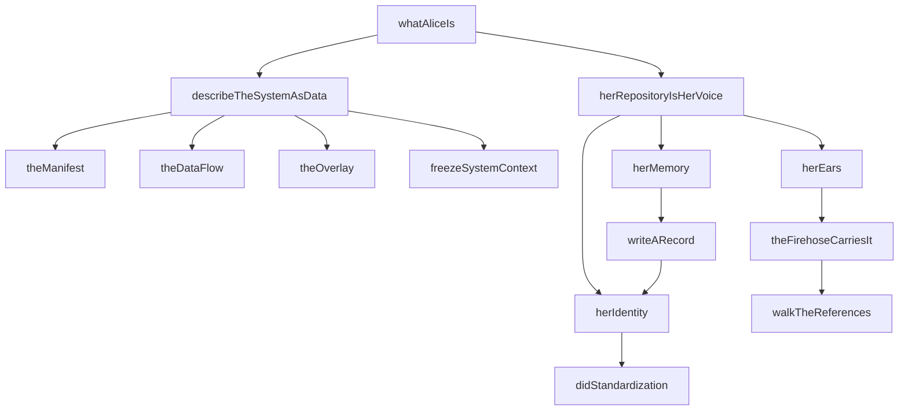
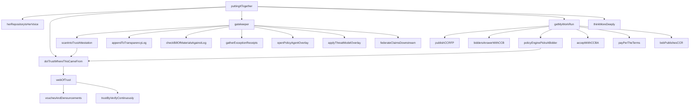
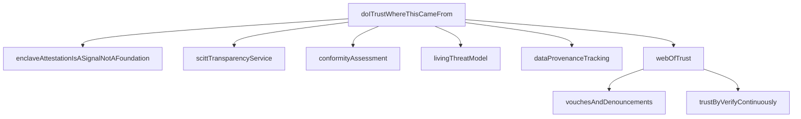
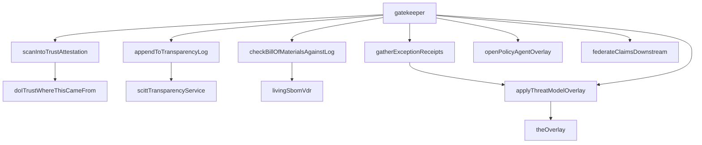
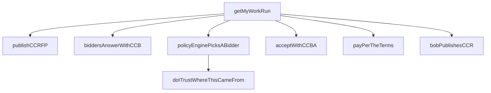
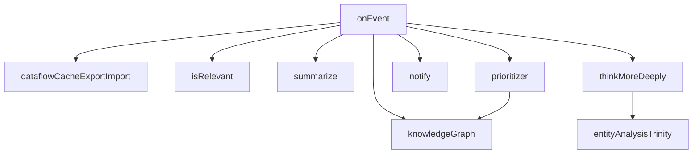
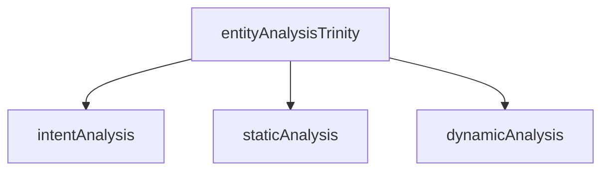
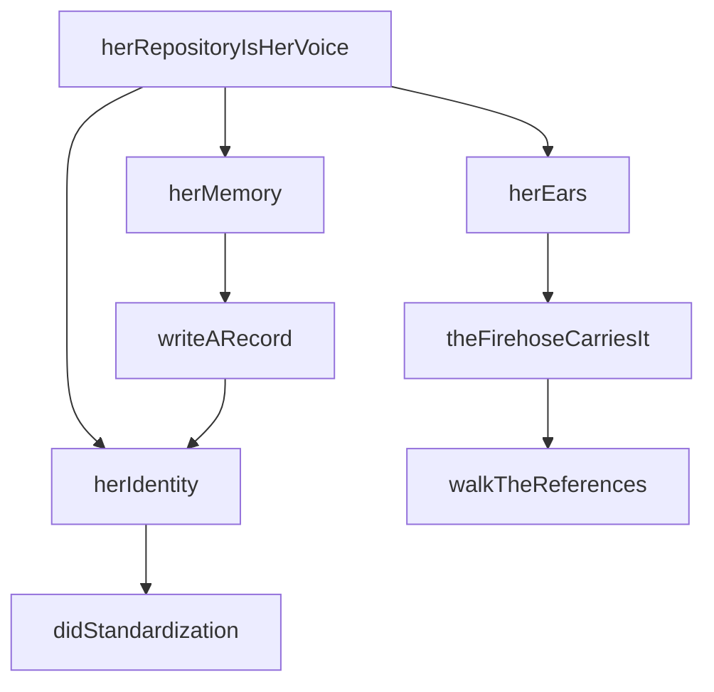
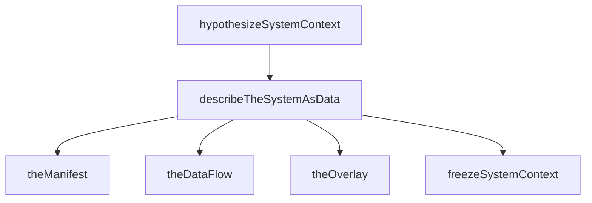

# OPEN ARCHITECTURE — CAVEMAN REPORT

```
         _    _ _
    /\  | |  (_) |
   /  \ | | __ _| |_ ___ ___
  / /\ \| |/ /| | __/ _ \ __|
 / ____ \   < | | ||  __/ |__
/_/    \_\_|\_\|_|\__\___|\__\

CAVEMAN MODE — full — 2026-06-29
```

## STATE

```
commsProcessed:  664 / 691      96.09% complete
concepts:        248            discovered
stubs:           243            hollow (no body yet)
issues:           10            open
```

27 comms remain unprocessed. 243 stubs = 97.98% of concepts
still need bodies. Only 5 concepts (248-243) have implementations.

## PACKAGE SIZES (by line count)

```
alice-supply-chain        117 ████████████████████████████████████████
alice-system-context       47 ████████████████
alice-trust                39 █████████████
alice-stream-of-conscious  31 ██████████
alice-communication        29 ██████████
alice-compute-contract     19 ██████
alice                      18 ██████
alice-common               14 ████
                             ──
                    total  314 lines of architecture
```

Supply chain dominates (117 lines = 37.3% of total). Common layer
smallest (14 lines = 4.5%) — wire types only.

## GLOBAL CALL GRAPH (top-level spine)

```
puttingItTogether(buildEvent)
├── herRepositoryIsHerVoice()
│   ├── herIdentity() → didStandardization()
│   ├── herMemory() → writeARecord() → herIdentity()
│   └── herEars() → theFirehoseCarriesIt() → walkTheReferences()
├── doITrustWhereThisCameFrom(source) → bool
│   ├── enclaveAttestationIsASignalNotAFoundation()
│   ├── scittTransparencyService()
│   ├── conformityAssessment()
│   ├── livingThreatModel()
│   ├── dataProvenanceTracking()
│   └── webOfTrust(operator)
│       ├── vouchesAndDenouncements(operator)
│       └── trustByVerifyContinuously()
├── gatekeeper(component)
│   ├── scanIntoTrustAttestation(component) → doITrustWhereThisCameFrom()
│   ├── appendToTransparencyLog() → scittTransparencyService()
│   ├── checkBillOfMaterialsAgainstLog() → livingSbomVdr()
│   ├── gatherExceptionReceipts() → applyThreatModelOverlay()
│   ├── openPolicyAgentOverlay()
│   ├── applyThreatModelOverlay() → theOverlay()
│   └── federateClaimsDownstream()
├── getMyWorkRun() → CCR
│   ├── publishCCRFP()
│   ├── biddersAnswerWithCCB(rfp)
│   ├── policyEnginePicksABidder(bids) → doITrustWhereThisCameFrom()
│   ├── acceptWithCCBA(bid)
│   ├── payPerTheTerms(accept)
│   └── bobPublishesCCR(accept)
└── thinkMoreDeeply() → entityAnalysisTrinity()
    ├── intentAnalysis()
    ├── staticAnalysis()
    └── dynamicAnalysis()
```

Entry by `puttingItTogether` when build event arrives on firehose.
Exit either `notify()` or recursive `thinkMoreDeeply()` via
`onEvent` loop.

---

## SUBSYSTEM 1 — whatAliceIs (identity + system context)



```
whatAliceIs()                        — root boot fn
├── describeTheSystemAsData()        → SystemContext
│   ├── theManifest()                → {intent, schema, data}
│   ├── theDataFlow()                → {operations, links}
│   ├── theOverlay()                 → {context, patch}
│   └── freezeSystemContext()        → SystemContext record
└── herRepositoryIsHerVoice()        — comms stack
    ├── herIdentity() → DID
    │   └── didStandardization()     — W3C DID 1.0
    ├── herMemory()                  — PDS repo
    │   └── writeARecord()           → RepoRecord
    │       └── herIdentity()        — signs record
    └── herEars()                    — firehose listener
        └── theFirehoseCarriesIt()
            └── walkTheReferences()  → StrongRef
```

whatAliceIs defines Alice: SystemContext says WHAT, comms
stack says HOW she speaks/hears. Two halves of identity.

---

## SUBSYSTEM 2 — puttingItTogether (build event loop)



```
puttingItTogether(buildEvent)
│
├── herRepositoryIsHerVoice()     [always]
├── doITrustWhereThisCameFrom?    [if no → abort]
│   ├── enclaveAttestationIsASignalNotAFoundation
│   ├── scittTransparencyService
│   ├── conformityAssessment
│   ├── livingThreatModel
│   ├── dataProvenanceTracking
│   └── webOfTrust(source) → bool
│       ├── vouchesAndDenouncements
│       └── trustByVerifyContinuously
├── gatekeeper(component)         [admit + policy]
│   ├── scanIntoTrustAttestation  → doITrustWhereThisCameFrom
│   ├── appendToTransparencyLog   → scittTransparencyService
│   ├── checkBillOfMaterialsAgainstLog → livingSbomVdr
│   ├── [if fail] gatherExceptionReceipts
│   ├── openPolicyAgentOverlay
│   ├── applyThreatModelOverlay   → theOverlay
│   └── federateClaimsDownstream
├── getMyWorkRun()               [if compute needed]
│   ├── publishCCRFP → {request}
│   ├── biddersAnswerWithCCB → [CCB]
│   ├── policyEnginePicksABidder → filter(doITrustWhereThisCameFrom)
│   ├── acceptWithCCBA → CCBA
│   ├── payPerTheTerms
│   └── bobPublishesCCR → CCR
└── thinkMoreDeeply()            [always]
    └── entityAnalysisTrinity()
```

Spine of entire system. Build event arrives → identity check→
trust check → gatekeeper admit → provision compute → think.

---

## SUBSYSTEM 3 — doITrustWhereThisCameFrom (trust engine)



```
doITrustWhereThisCameFrom(source: DID) → bool
├── enclaveAttestationIsASignalNotAFoundation
│     "hardware cannot carry the whole weight"
│     tee.fail reference — memory bus interposition
├── scittTransparencyService
│     content-agnostic. holds SBOMs, attestations,
│     system contexts, policies
├── conformityAssessment
│     ISO/IEC 17000: 1st/2nd/3rd party attestation
│     weighted by web of trust history
├── livingThreatModel
│     threats, mitigations, trust boundaries as
│     initial dataset. evolves with every attestation
│     through gatekeeper
├── dataProvenanceTracking
│     provenance on inference ← training data,
│     model env, config. feeds prioritizer
└── webOfTrust(operator) → bool
    ├── vouchesAndDenouncements(operator)
    │     records over time. walked like train of thought
    └── trustByVerifyContinuously
          "re-evaluated forever, never decided once"
```

Trust foundation. Hardware attestation = signal, not foundation.
Real foundation = web of trust + continuous re-verification.
SCITT = append-only transparency log for all artifacts.

---

## SUBSYSTEM 4 — gatekeeper (supply chain admission)



```
gatekeeper(component: StrongRef)
├── scanIntoTrustAttestation(component) → StrongRef
│   └── doITrustWhereThisCameFrom("did:plc:")
├── appendToTransparencyLog(attestation)
│   └── scittTransparencyService()
│         append only. indexed. feeds next round
├── checkBillOfMaterialsAgainstLog(component) → bool
│   └── livingSbomVdr()
│         NIST VDR: living doc linked from SPDX 2.3 SBOM
│         continuously updated vuln status per component
├── [if !check] gatherExceptionReceipts(component)
│   └── applyThreatModelOverlay()
│         re-issue admission with exception overlay
├── openPolicyAgentOverlay()
│     OPA → JSON → DID/VC/SCITT
│     admission + evaluation policies
├── applyThreatModelOverlay()
│   └── theOverlay()
└── federateClaimsDownstream()
      provenance intact → every downstream forge
```

Most lines in system (117). Gatekeeper = loop: scan → log →
check SBOM → admit/reject → policy → threat model → federate.
Exception receipts bend policy through signed process, not
silent break.

---

## SUBSYSTEM 5 — getMyWorkRun (compute contracts)



```
getMyWorkRun() → CCR
├── publishCCRFP() → CCRFP
│     request manifest: intent + schema + data
├── biddersAnswerWithCCB(rfp) → CCB[]
│     each bidder answers against RFP
├── policyEnginePicksABidder(bids) → CCB
│     filter(bids, bid => doITrustWhereThisCameFrom(bid.bidder))
│     picks trusted bidder. trust graph drives selection
├── acceptWithCCBA(bid) → CCBA
│     accepts with strong ref to bid
├── payPerTheTerms(accept)
│     "receipts are the only currency"
│     awal x402 pay https://...
└── bobPublishesCCR(accept) → CCR
      chain: {request, bid, accept} all strong refs
      evidence: proof work done as agreed
```

6-step compute contract flow. Trust graph gates bidder
selection in step 3. Strong references chain entire
provenance trail. CCR = proof.

Also: `reverseProxyEnforcesAccess(workload)` — no standing
credentials. token exchange, role based, least privilege.

---

## SUBSYSTEM 6 — onEvent (stream of consciousness)



```
onEvent(event: unknown)
├── knowledgeGraph(event)           [always — record]
│     every entry carries provenance through
│     inference chain → auditable decisions
├── dataflowCacheExportImport()     [always — persist]
│     export orchestrator state to pickle/JSON
│     re-import to resume. GraphQL query cache
├── isRelevant(event)?              [no → drop]
│     "source she trusts, context she's in"
├── summarize(event) → changes
├── prioritizer(changes) → "notify"|"think"|"act"
│   └── knowledgeGraph(changes)
│         scores possibilities. provenance feeds
│         intent-based policy decisions
├── [if notify] notify(changes)
│     "notify-send" popup. Alice tells you what
│     you'd want to know, when you'd want to know it
└── [else] thinkMoreDeeply()
      └── entityAnalysisTrinity()
            chain of sub-contexts. higher order concepts
            from clusters of strategic plans
```

Event loop: record → filter → prioritize → notify or think.
Thinking more deeply = EAT (entity analysis trinity).
Cache export/import enables resume across restarts.

`shareAThought()` → `hypothesizeSystemContext()` — one
instance shares hypothesized SystemContext with another.
Alice decides if she likes the thought.

---

## SUBSYSTEM 7 — entityAnalysisTrinity (EAT)



```
entityAnalysisTrinity() → EntityAnalysisTrinity
├── intentAnalysis() → unknown
│     "what the entity aimed to do"
├── staticAnalysis() → unknown
│     "what the code says"
└── dynamicAnalysis() → unknown
      "how the code behaves"
```

Three corners of analysis on every entity. Intent, static,
dynamic. Used by thinkMoreDeeply to build higher-order
concepts from clusters of strategic plans. All three stubs
(return undefined) — 0 implementations.

---

## SUBSYSTEM 8 — herRepositoryIsHerVoice (comms)



```
herRepositoryIsHerVoice()
├── herIdentity() → DID
│   └── didStandardization()
│         W3C DID 1.0 Recommendation (July 2022)
├── herMemory()
│   └── writeARecord() → RepoRecord
│       └── herIdentity()   ← signs with repo key
│             content-addressed by CID. cannot
│             quietly change after the fact
└── herEars()
    └── theFirehoseCarriesIt()
        └── walkTheReferences() → StrongRef
              URI + CID. walk references = walk
              her whole reasoning chain
```

Three pillars: identity (DID), memory (PDS repo), ears
(firehose). Records form strong reference chains. Walk
references = walk train of thought.

---

## SUBSYSTEM 9 — describeTheSystemAsData (system context)



```
describeTheSystemAsData() → SystemContext
├── theManifest() → Manifest
│     says WHAT: intent + schema + data
│     data present → Alice must use it
├── theDataFlow() → DataFlow
│     says HOW: operations graph + links
│     consumes the manifest
├── theOverlay() → Overlay
│     says IN WHAT CONTEXT: policy, deployment,
│     living threat model, patched on top
└── freezeSystemContext(upstream, overlays, orchestrator)
    → SystemContext
      frozen for one execution. a "Thought"

hypothesizeSystemContext() → SystemContext
└── describeTheSystemAsData()
      one instance hypothesizes, shares with another.
      Alice decides if she likes the thought
```

SystemContext = Manifest (what) + DataFlow (how) + Overlay
(in what context). Frozen unit of reasoning = a Thought.
Thinking = chain of sub-contexts.

---

## WIRE TYPES (alice-common — Layer 0)

```
DID           = string           portable signed identity
CID           = string           content address
ATURI         = string           at:// record locator
StrongRef     = { uri, cid }    URI + CID must match
Manifest      = { intent, schema, data }
DataFlow      = { operations, links[] }
Overlay       = { context, patch }
SystemContext = { upstream, overlays[], orchestrator }
RepoRecord    = { uri, cid, author, value }
CCRFP         = { request: Manifest }
CCB           = { against, bidder: DID, terms }
CCBA          = { accepts: StrongRef }
CCR           = { chain{req,bid,accept}, evidence }
EntityAnalysisTrinity = { intent, staticAnalysis, dynamicAnalysis }
```

All 8 packages import from alice-common. No cycle —
common imports nothing project-local.

---

## PACKAGE IMPORT MAP

```
alice-common (14 lines)
  ↑ imports: external only
alice-trust-abc (39 lines) ──────────┐
alice-system-context-abc (47 lines) ─┤
alice-communication-abc (29 lines) ───┤ all import alice-common
alice-compute-contract-abc (19 lines)┘
alice-stream-of-consciousness-abc ────┤
alice-supply-chain-abc (117 lines) ───┤
alice-abc (18 lines) ─────────────────┘
```

Cross-concept imports:
- `supply-chain` imports `trust` (doITrustWhereThisCameFrom,
  scittTransparencyService) + `system-context` (theOverlay)
- `compute-contract` imports `trust` (doITrustWhereThisCameFrom)
- `stream-of-consciousness` imports `system-context`
  (entityAnalysisTrinity, hypothesizeSystemContext)
- `communication` imports `common` only
- `alice` imports `system-context` + `communication`
- `trust` imports `common` only

Arrow strictly common → abc. No abc imports impl. This
repo is pure ABC layer — architecture only, no I/O.

---

## BATCH HISTORY

```
#  concepts  elapsed   new  refine  attempts
1      4      67.8s     2     2        1
2      1      77.9s     1     0        2     ← retry batch
3      5      58.5s     5     0        1
4      0      (null)    0     0        2     ← zero-find batch
5      1      31.0s     1     0        1
6      5     104.7s     4     1        1
7      1      35.5s     1     0        1
8      3      58.6s     2     1        1
9      5      93.1s     4     1        1
10     6      66.2s     4     2        1
────────────────────────────────────────────
SUM   31             24     7
AVG    3.1   66.0s   2.4   0.7
```

Total concepts found: 24 new + 7 refined = 31 across
10 batches. Avg 3.1 per batch. Batch 4 zero-find after
2 attempts → batch stall. Batch 2 required retry (2
attempts, 1 concept). Elapsed: 31s-104.7s, avg 66s.

---

## KEY INSIGHTS

1. **Architecture-only, no I/O.** All packages in `lib/abc/`.
   No `lib/*-transport/` or `lib/hono-factory-*/` for open-
   architecture. Pure design, 0 runtime code.

2. **243 stubs, 5 bodies.** 97.98% stub rate. Concepts
   discovered but not implemented. Only 5 functions have
   bodies beyond stub/return: puttingItTogether, gatekeeper,
   getMyWorkRun, whatAliceIs, herRepositoryIsHerVoice,
   onEvent, describeTheSystemAsData, entityAnalysisTrinity,
   doITrustWhereThisCameFrom, webOfTrust.

3. **Trust graph central.** doITrustWhereThisCameFrom called
   by: puttingItTogether, gatekeeper (via scanIntoTrust
   Attestation), getMyWorkRun (via policyEnginePicksABidder).
   Three subsystems all depend on web of trust.

4. **SCITT doubles as transparency log.** scittTransparency
   Service called by both trust engine (doITrust...) and
   gatekeeper (appendToTransparencyLog). Single log for
   attestations AND system contexts.

5. **Strong references chain everything.** CCRFP → CCB →
   CCBA → CCR all use StrongRef (URI+CID). Walk refs =
   walk provenance. Receipt = proof.

6. **Exception receipts = policy bending, not breaking.**
   When checkBillOfMaterialsAgainstLog fails, gatherException
   Receipts collects signatures, re-issues admission with
   exception overlay. Documented, signed, auditable.

7. **10 open issues.** 27 remaining comms to process.
   Batch throughput: ~3.1 concepts/batch at ~66s/batch.
   At current rate: ~9 more batches to clear backlog.
