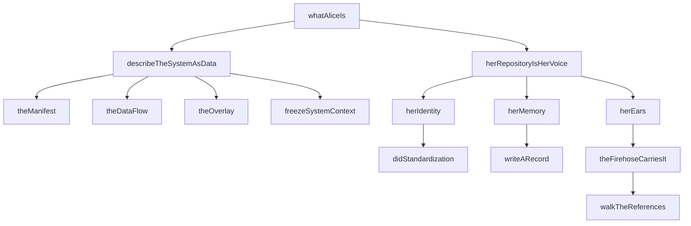
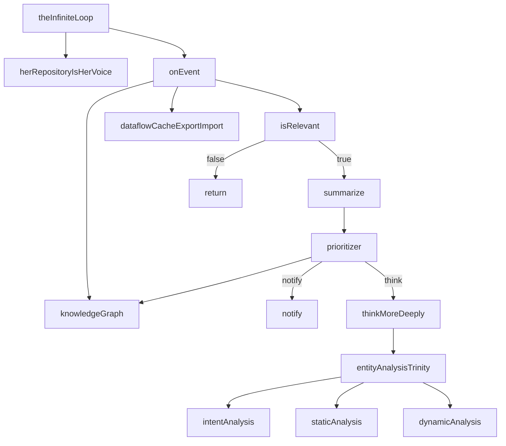
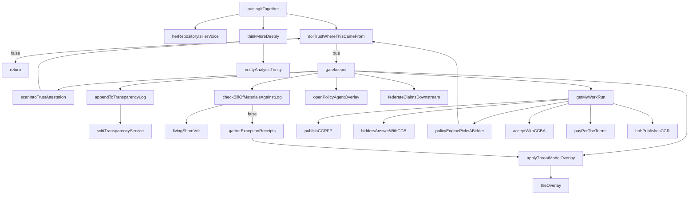
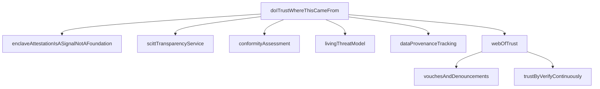
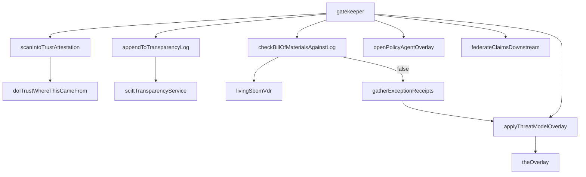
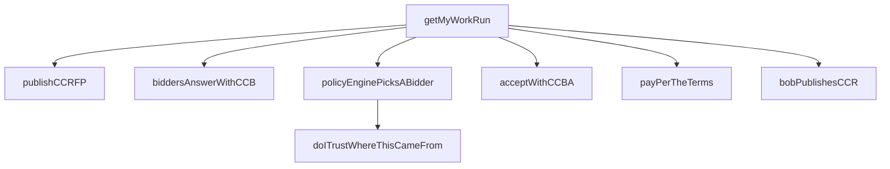
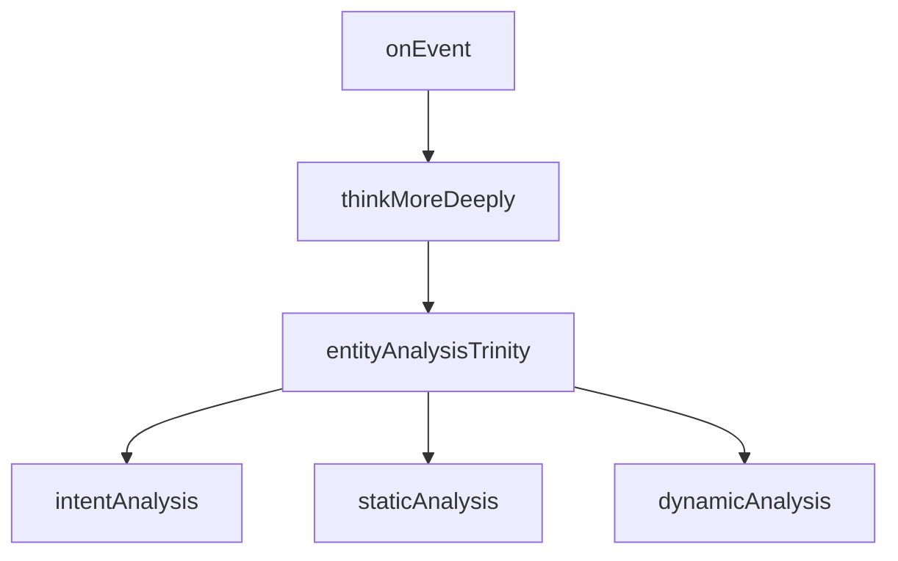
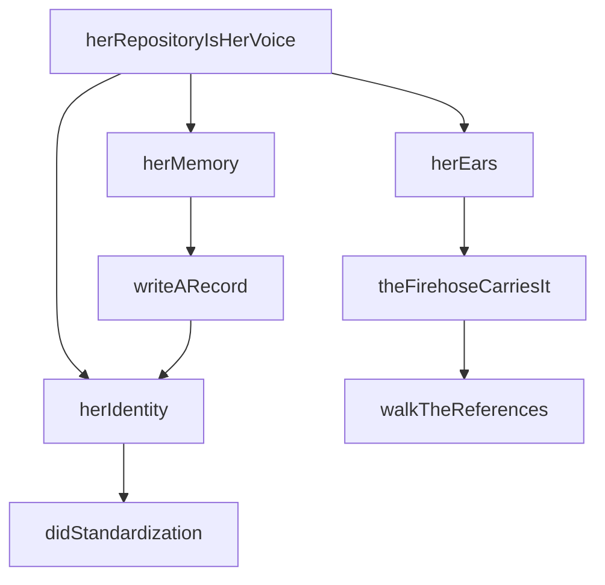
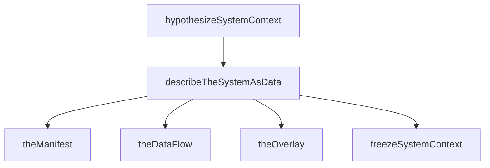

# Alice Open Architecture — Caveman Report

Date: 2026-06-29. Live state from `.codegraph/` index. Stub-only codebase.
No I/O, no transport, no tests. Pure ABC-layer function shells wired by
docs-as-code from `open_architecture_today.md`.

## State

```
comms processed   160 / 691   (23.15%)
concepts found    100
stubs written      95        ← concept → stub yield = 95%
open issues         9
```

## Batch History

| batch | found | elapsed | new | refined | attempts |
|-------|-------|---------|-----|---------|----------|
| 1     | 1     | 39.9s   | 1   | 0       | 1        |
| 2     | 7     | 107.5s  | 6   | 1       | 1        |

Pattern: batch 1 = warm-up (1 concept). Batch 2 = bulk (6 new, 1 refined).
Agent writes stubs; stubs become next batch seeds.

## Package Sizes (ASCII bars)

```
alice-supply-chain     ██████████████████████████████████████ 38
alice-system-context   ████████████████████████████████████ 36
alice-trust            ██████████████████████ 18
alice-stream-of-consc  █████████████████ 17
alice-common           ██████████████ 14
alice                  ████████████ 12
alice-compute-contract ███████████ 11
alice-communication    ███████████ 11
```

`alice-common` = types only (DID, CID, StrongRef, Manifest, DataFlow,
Overlay, SystemContext, CCB, CCBA, CCR, CCRFP, EntityAnalysisTrinity).
All other packages import from it. Zero cross-package imports except
through common.

## Dep Graph (ABC layer only)

```
alice-common (types)
    ^
    +---- alice-trust (doITrustWhereThisCameFrom, webOfTrust, ...)
    |        ^
    |        +---- alice-supply-chain (gatekeeper, scanIntoTrustAttestation, ...)
    |                 ^
    |                 +---- alice-compute-contract (getMyWorkRun, policyEnginePicksABidder)
    |                            ^
    |                            +---- alice (puttingItTogether, theInfiniteLoop)
    |
    +---- alice-communication (herRepositoryIsHerVoice, writeARecord, ...)
    |        ^
    |        +---- alice (whatAliceIs)
    |
    +---- alice-system-context (describeTheSystemAsData, entityAnalysisTrinity, ...)
    |        ^
    |        +---- alice-stream-of-consciousness (onEvent, thinkMoreDeeply, ...)
    |                 ^
    |                 +---- alice (theInfiniteLoop, puttingItTogether)
    |
    alice (entrypoint/synthesis — calls all above)
```

No cycles. Common ← abc. Arrows = import direction.

---

## SUBSYSTEM 1: whatAliceIs → Entry Point

Calls describeTheSystemAsData + herRepositoryIsHerVoice.
Top-level identity self-description. No params, no return.



```
whatAliceIs
  ├── describeTheSystemAsData
  │     ├── theManifest → {intent, schema, data}
  │     ├── theDataFlow → {operations, links}
  │     ├── theOverlay → {context, patch}
  │     └── freezeSystemContext → SystemContext
  └── herRepositoryIsHerVoice
        ├── herIdentity → didStandardization → DID
        ├── herMemory → writeARecord → RepoRecord
        └── herEars → theFirehoseCarriesIt → walkTheReferences
```

---

## SUBSYSTEM 2: theInfiniteLoop → Event Loop

Entry: `event` arrives from firehose. Calls herRepositoryIsHerVoice
(re-establish identity context) then onEvent to process.



```
theInfiniteLoop(event)
  ├── herRepositoryIsHerVoice()
  └── onEvent(event)
        ├── knowledgeGraph(event)
        ├── dataflowCacheExportImport()
        ├── isRelevant(event)?
        │     ├── false → return
        │     └── true → summarize(event)
        │           └── prioritizer(changes)
        │                 ├── "notify" → notify(changes)
        │                 └── "think" → thinkMoreDeeply()
        │                       └── entityAnalysisTrinity()
        │                             ├── intentAnalysis()
        │                             ├── staticAnalysis()
        │                             └── dynamicAnalysis()
```

---

## SUBSYSTEM 3: puttingItTogether → Full RFP Flow

Bob pushes build. Alice hears it on firehose. Trust check → gatekeeper
admission → compute contract → deeper thought.



```
puttingItTogether(buildEvent)
  ├── herRepositoryIsHerVoice()
  ├── doITrustWhereThisCameFrom(source)?
  │     └── false → return
  ├── gatekeeper(component)
  │     ├── scanIntoTrustAttestation → doITrustWhereThisCameFrom
  │     ├── appendToTransparencyLog → scittTransparencyService
  │     ├── checkBillOfMaterialsAgainstLog → livingSbomVdr
  │     │     └── false → gatherExceptionReceipts
  │     │           └── applyThreatModelOverlay → theOverlay
  │     ├── openPolicyAgentOverlay()
  │     ├── applyThreatModelOverlay → theOverlay
  │     └── federateClaimsDownstream()
  ├── getMyWorkRun()
  │     ├── publishCCRFP() → CCRFP
  │     ├── biddersAnswerWithCCB(rfp) → CCB[]
  │     ├── policyEnginePicksABidder(bids) → CCB
  │     │     └── doITrustWhereThisCameFrom per bidder
  │     ├── acceptWithCCBA(chosen) → CCBA
  │     ├── payPerTheTerms(accept)
  │     └── bobPublishesCCR(accept) → CCR
  └── thinkMoreDeeply() → entityAnalysisTrinity
```

---

## SUBSYSTEM 4: doITrustWhereThisCameFrom → Trust Engine

6-layered trust decision. Hardware attestation is signal, web of trust
is foundation. Converges to boolean.



```
doITrustWhereThisCameFrom(source: DID) → boolean
  ├── enclaveAttestationIsASignalNotAFoundation()  ← TEE quote, weighted
  ├── scittTransparencyService()                    ← SBOMs, attestations
  ├── conformityAssessment()                        ← ISO/IEC 17000, 1st/2nd/3rd party
  ├── livingThreatModel()                           ← threats, mitigations
  ├── dataProvenanceTracking()                      ← inference provenance
  └── webOfTrust(operator)
        ├── vouchesAndDenouncements(operator)
        └── trustByVerifyContinuously()
              → return true
```

---

## SUBSYSTEM 5: gatekeeper → Supply Chain Admission

Scan → attest → check BOM against log → apply threat overlay → federate.



```
gatekeeper(component: StrongRef)
  ├── scanIntoTrustAttestation → doITrustWhereThisCameFrom
  ├── appendToTransparencyLog → scittTransparencyService
  ├── checkBillOfMaterialsAgainstLog → livingSbomVdr
  │     └── false → gatherExceptionReceipts
  │           └── applyThreatModelOverlay → theOverlay
  ├── openPolicyAgentOverlay()  ← OPA → JSON → DID/VC/SCITT
  ├── applyThreatModelOverlay → theOverlay
  └── federateClaimsDownstream()
```

---

## SUBSYSTEM 6: getMyWorkRun → Compute Contract Lifecycle

6-step RFP → bid → accept → pay → receipt pipeline.
Alice owns nothing. Rents compute via signed chain.



```
getMyWorkRun() → CCR
  ├── publishCCRFP() → CCRFP { request: Manifest }
  ├── biddersAnswerWithCCB(rfp) → CCB[]
  ├── policyEnginePicksABidder(bids) → CCB
  │     └── doITrustWhereThisCameFrom(bidder) per bid
  ├── acceptWithCCBA(chosen) → CCBA { accepts: StrongRef }
  ├── payPerTheTerms(accept)
  │     └── Receipts are the only currency
  └── bobPublishesCCR(accept) → CCR
        └── chain: { request, bid, accept } + evidence

Supporting stubs (same file, not in main flow):
  reverseProxyEnforcesAccess(workload)   ← no standing creds
  reverseTunnelIsServiceDiscovery()       ← relay is registry
  headlessScaleToZeroCiRunner()           ← systemd + actions runner
  billOfLadingComputeContract()           ← W3C traceability vocab
```

---

## SUBSYSTEM 7: entityAnalysisTrinity → Strategic Reasoning

Three corners of entity analysis. Feeds thinkMoreDeeply.



```
entityAnalysisTrinity() → EntityAnalysisTrinity
  ├── intentAnalysis()      → unknown   ← what entity aimed to do
  ├── staticAnalysis()      → unknown   ← what code says
  └── dynamicAnalysis()     → unknown   ← how code behaves

Callers:
  thinkMoreDeeply() → entityAnalysisTrinity()
  prioritizer → returns "think" → triggers thinkMoreDeeply
```

---

## SUBSYSTEM 8: herRepositoryIsHerVoice → Identity + Memory + Ears

Alice lives on network: DID identity, PDS memory, firehose ears.



```
herRepositoryIsHerVoice()
  ├── herIdentity() → DID
  │     └── didStandardization()   ← W3C Rec July 2022
  ├── herMemory()
  │     └── writeARecord() → RepoRecord { uri, cid, author, value }
  │           └── herIdentity()
  └── herEars()
        └── theFirehoseCarriesIt()
              └── walkTheReferences() → StrongRef

Extensions (same file, not main flow):
  entrypointsAsSystemContextDids()
  didEntrypointWorkflowTrigger()
  sigstoreScittDidVcBridge()
```

---

## SUBSYSTEM 9: describeTheSystemAsData → System Context

Manifest (what) + DataFlow (how) + Overlay (context) → frozen SystemContext.
A Thought.



```
describeTheSystemAsData() → SystemContext
  ├── theManifest() → Manifest { intent, schema, data }
  ├── theDataFlow() → DataFlow { operations, links }
  ├── theOverlay() → Overlay { context, patch }
  └── freezeSystemContext(upstream, overlays, orchestrator)
        → { upstream, overlays, orchestrator }

Callers:
  whatAliceIs → describeTheSystemAsData
  hypothesizeSystemContext → describeTheSystemAsData
```

---

## Full Cross-Subsystem Call Graph (merged)

```mermaid
graph TD
  WA[whatAliceIs] --> DTSD[describeTheSystemAsData]
  WA --> HRIV[herRepositoryIsHerVoice]

  TIL[theInfiniteLoop] --> HRIV
  TIL --> OE[onEvent]

  PIT[puttingItTogether] --> HRIV
  PIT --> DITWCF[doITrustWhereThisCameFrom]
  PIT --> GK[gatekeeper]
  PIT --> GMWR[getMyWorkRun]
  PIT --> TMD[thinkMoreDeeply]

  DITWCF --> EAISNF[enclaveAttestationIsASignalNotAFoundation]
  DITWCF --> STS[scittTransparencyService]
  DITWCF --> CA[conformityAssessment]
  DITWCF --> LTM[livingThreatModel]
  DITWCF --> DPT[dataProvenanceTracking]
  DITWCF --> WOT[webOfTrust]
  WOT --> VAD[vouchesAndDenouncements]
  WOT --> TBVC[trustByVerifyContinuously]

  GK --> SITA[scanIntoTrustAttestation]
  SITA --> DITWCF
  GK --> ATTL[appendToTransparencyLog]
  ATTL --> STS
  GK --> CBML[checkBillOfMaterialsAgainstLog]
  CBML --> LSV[livingSbomVdr]
  GK --> OPAO[openPolicyAgentOverlay]
  GK --> ATMO[applyThreatModelOverlay]
  ATMO --> TO[theOverlay]
  GK --> FCD[federateClaimsDownstream]
  CBML -.->|false| GER[gatherExceptionReceipts]
  GER --> ATMO

  GMWR --> PCCRFP[publishCCRFP]
  GMWR --> BAWCCB[biddersAnswerWithCCB]
  GMWR --> PEPAB[policyEnginePicksABidder]
  PEPAB --> DITWCF
  GMWR --> AWCCBA[acceptWithCCBA]
  GMWR --> PPTT[payPerTheTerms]
  GMWR --> BPCCR[bobPublishesCCR]

  HRIV --> HI[herIdentity]
  HRIV --> HM[herMemory]
  HRIV --> HE[herEars]
  HI --> DS[didStandardization]
  HM --> WAR[writeARecord]
  WAR --> HI
  HE --> TFCI[theFirehoseCarriesIt]
  TFCI --> WTR[walkTheReferences]

  DTSD --> TM[theManifest]
  DTSD --> TDF[theDataFlow]
  DTSD --> TO
  DTSD --> FSC[freezeSystemContext]

  OE --> KG[knowledgeGraph]
  OE --> DCEI[dataflowCacheExportImport]
  OE --> IR[isRelevant]
  IR -.->|false| OER[return]
  IR -.->|true| SUM[summarize]
  SUM --> PRI[prioritizer]
  PRI --> KG
  PRI -.->|notify| NOT[notify]
  PRI -.->|think| TMD
  TMD --> EAT[entityAnalysisTrinity]
  EAT --> IA[intentAnalysis]
  EAT --> SA[staticAnalysis]
  EAT --> DA[dynamicAnalysis]
```



---

## Type Wire (alice-common)

```
DID = string
CID = string
ATURI = string

StrongRef { uri: ATURI, cid: CID }
Manifest { intent: string, schema: unknown, data: unknown }
DataFlow { operations: Record<string,unknown>, links: StrongRef[] }
Overlay { context: string, patch: unknown }
SystemContext { upstream: Manifest, overlays: Overlay[], orchestrator: DataFlow }

CCRFP { request: Manifest }
CCB { against: StrongRef, bidder: DID, terms: unknown }
CCBA { accepts: StrongRef }
CCR { chain: { request, bid, accept: StrongRef }, evidence: unknown }

RepoRecord { uri: ATURI, cid: CID, author: DID, value: unknown }
EntityAnalysisTrinity { intent: unknown, staticAnalysis: unknown, dynamicAnalysis: unknown }
```

## Notes

All stubs (95 of 100 concepts). Zero transport layer, zero Hono factories,
zero CLI. ABC-only. Stub functions return hardcoded values or undefined.
`doITrustWhereThisCameFrom` always returns true via `webOfTrust`.
`isRelevant` always returns false. `policyEnginePicksABidder` returns
first trusted bid or first bid. `publishCCRFP` returns empty manifest.
`biddersAnswerWithCCB` returns empty array. This is intentional: the
stubs are the spec. Transport layer fills them in.

9 open issues tracked. Each comm processed by `alice-eng-comms` agent
(from `.claude/agents/`) reads a comm file, extracts concepts, writes
stub functions. 23% of 691 comms processed so far.

Codebase is the architecture document. Read the stubs = read the spec.
No implementation diverges because there is no implementation yet.
