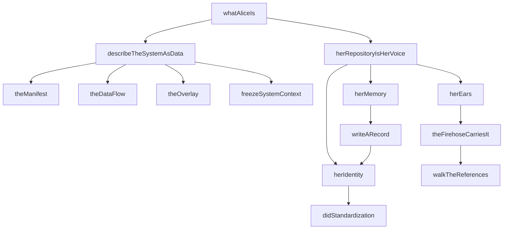
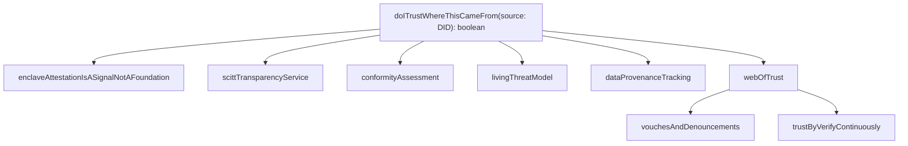
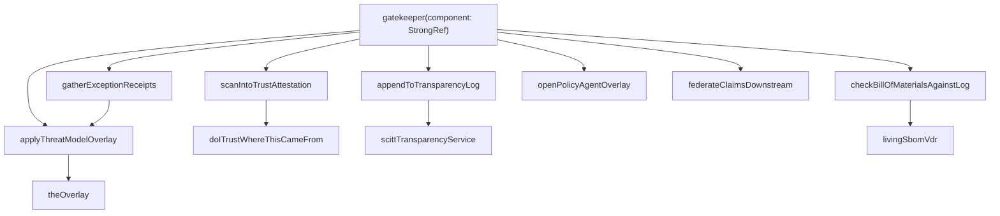
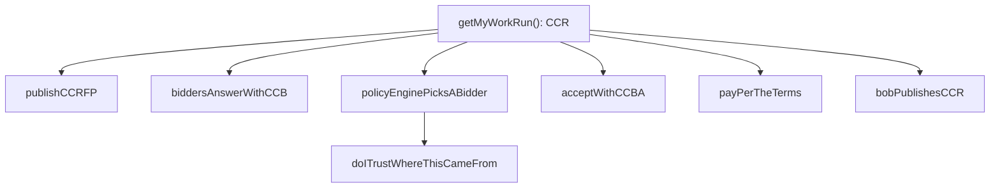
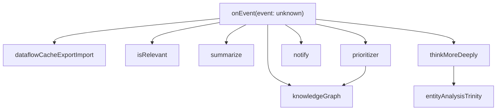
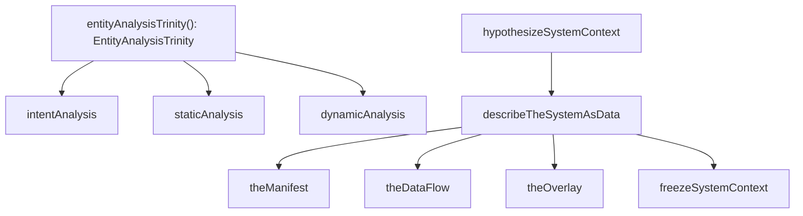
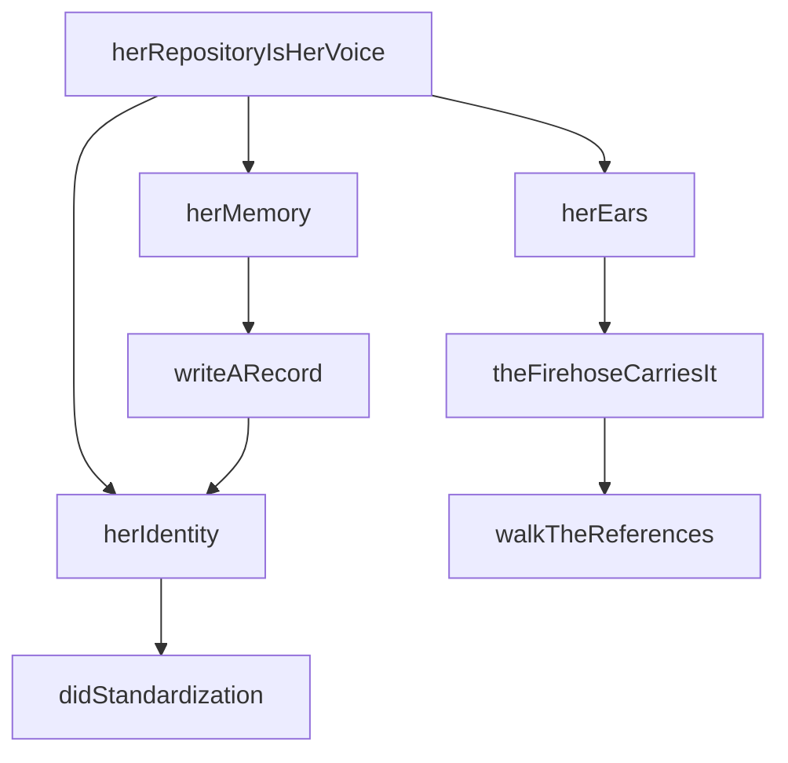
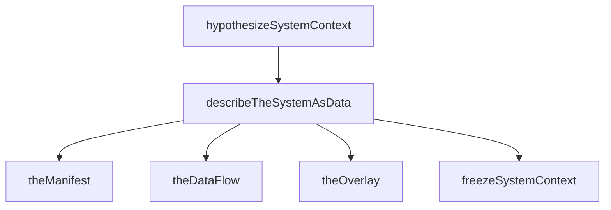

# Alice Open Architecture — Caveman Report

## State

```
commsProcessed:  480 / 691  (69.5%)
concepts:        202
stubs:           197  (97.5% of concepts are stubs)
issues:           10
```

197 of 202 concepts are stubs. Architecture is docs-as-code skeleton.
Real implementation in hono-pds, atproto-market, hono-compute-provider
(separate repos). This repo is the blueprint.

## Package sizes (ASCII bars)

```
alice-supply-chain    ████████████████████████████████████████████████████████████████████████████████████████████ 94
alice-system-context  ██████████████████████████████████████████████████ 46
alice-trust           ███████████████████████████████████ 35
alice-communication   █████████████████████████ 25
alice-stream-of-con…  ███████████████████████ 23
alice                 ████████████████ 16
alice-compute-cont…   ███████████████ 15
alice-common          ██████████████ 14
                                         total: 268 symbols
```

## Batch history

```
batch 0:  7 concepts, 100.7s,  4 new, 3 refined, 1 attempt
batch 1:  0 concepts, FAIL   ,  0 new, 0 refined, 2 attempts  ← FAIL
batch 2:  4 concepts,  86.3s,  3 new, 1 refined, 1 attempt
batch 3:  1 concept,   42.3s,  1 new, 0 refined, 1 attempt
batch 4:  1 concept,   60.7s,  1 new, 0 refined, 1 attempt
batch 5:  7 concepts, 123.0s,  4 new, 3 refined, 1 attempt
batch 6: 10 concepts, 142.7s,  7 new, 3 refined, 1 attempt  ← peak
batch 7:  0 concepts, FAIL   ,  0 new, 0 refined, 2 attempts  ← FAIL
batch 8:  4 concepts, 127.6s,  4 new, 0 refined, 2 attempts
batch 9:  5 concepts,  92.8s,  2 new, 3 refined, 1 attempt
```

39 concepts across 8 successful batches. 2 failures (batches 1, 7).
Batch 6 peak: 10 concepts, 7 new. Avg successful: ~97s.

## Topology

All ABC layer (lib/abc/alice*/mod.ts). Zero impl, zero factory, zero CLI.
This repo is pure architecture — the blueprint layer.

```
alice/mod.ts  ← composes all sibling abc packages
  imports from:
    @publicdomainrelay/alice-communication-abc
    @publicdomainrelay/alice-trust-abc
    @publicdomainrelay/alice-compute-contract-abc
    @publicdomainrelay/alice-supply-chain-abc
    @publicdomainrelay/alice-stream-of-consciousness-abc
    @publicdomainrelay/alice-system-context-abc
  depends on:
    @publicdomainrelay/alice-common  (types)
```

Dep arrow: alice-common ← all abc packages. No cycles.
alice-supply-chain imports from alice-trust + alice-system-context
(lateral abc→abc for composition). alice top-level composes all.

---

## SUBSYSTEM 1: whatAliceIs — her shape

Entrypoint defining Alice. Produces SystemContext, wires communication.



```
whatAliceIs()
  describeTheSystemAsData() → SystemContext
    theManifest() → {intent:"", schema:undefined, data:undefined}
    theDataFlow() → {operations:{}, links:[]}
    theOverlay() → {context:"", patch:undefined}
    freezeSystemContext(upstream, overlays, orchestrator)
  herRepositoryIsHerVoice()
    herIdentity() → "did:plc:"
      didStandardization() → stub (W3C DID 1.0, July 2022)
    herMemory() → writeARecord() → {uri:"at://", cid:"", author:"did:plc:", value:undefined}
    herEars() → theFirehoseCarriesIt() → walkTheReferences() → {uri:"at://", cid:""}
```

---

## SUBSYSTEM 2: puttingItTogether — full build pipeline

Bob pushes build. Alice hears → trusts → gates → provisions compute → thinks deeper.

```mermaid
graph TD
  puttingItTogether --> herRepositoryIsHerVoice
  puttingItTogether --> doITrustWhereThisCameFrom
  puttingItTogether --> gatekeeper
  puttingItTogether --> getMyWorkRun
  puttingItTogether --> thinkMoreDeeply
  doITrustWhereThisCameFrom --> enclaveAttestationIsASignalNotAFoundation
  doITrustWhereThisCameFrom --> scittTransparencyService
  doITrustWhereThisCameFrom --> conformityAssessment
  doITrustWhereThisCameFrom --> livingThreatModel
  doITrustWhereThisCameFrom --> dataProvenanceTracking
  doITrustWhereThisCameFrom --> webOfTrust
  webOfTrust --> vouchesAndDenouncements
  webOfTrust --> trustByVerifyContinuously
  gatekeeper --> scanIntoTrustAttestation
  gatekeeper --> appendToTransparencyLog
  gatekeeper --> checkBillOfMaterialsAgainstLog
  gatekeeper --> gatherExceptionReceipts
  gatekeeper --> openPolicyAgentOverlay
  gatekeeper --> applyThreatModelOverlay
  gatekeeper --> federateClaimsDownstream
  scanIntoTrustAttestation --> doITrustWhereThisCameFrom
  appendToTransparencyLog --> scittTransparencyService
  checkBillOfMaterialsAgainstLog --> livingSbomVdr
  gatherExceptionReceipts --> applyThreatModelOverlay
  applyThreatModelOverlay --> theOverlay
  getMyWorkRun --> publishCCRFP
  getMyWorkRun --> biddersAnswerWithCCB
  getMyWorkRun --> policyEnginePicksABidder
  getMyWorkRun --> acceptWithCCBA
  getMyWorkRun --> payPerTheTerms
  getMyWorkRun --> bobPublishesCCR
  policyEnginePicksABidder --> doITrustWhereThisCameFrom
  thinkMoreDeeply --> entityAnalysisTrinity
```



```
puttingItTogether(buildEvent: {source: string})
  herRepositoryIsHerVoice()
    herIdentity() → didStandardization()
    herMemory() → writeARecord()
    herEars() → theFirehoseCarriesIt() → walkTheReferences()
  if !doITrustWhereThisCameFrom(buildEvent.source) → return (BLOCK)
    enclaveAttestationIsASignalNotAFoundation()  [TEE signal, not foundation]
    scittTransparencyService()                   [content-agnostic append-only log]
    conformityAssessment()                       [ISO/IEC 17000 weighted]
    livingThreatModel()                          [evolves per attestation]
    dataProvenanceTracking()                     [inference provenance chain]
    webOfTrust(source) → true
      vouchesAndDenouncements(operator)          [records over time]
      trustByVerifyContinuously()                [re-evaluated forever]
  gatekeeper({uri:"at://", cid:""})
    attestation = scanIntoTrustAttestation(component)
      → doITrustWhereThisCameFrom("did:plc:")
    appendToTransparencyLog(attestation) → scittTransparencyService()
    if !checkBillOfMaterialsAgainstLog(component)
      → gatherExceptionReceipts() → applyThreatModelOverlay() → theOverlay()
    openPolicyAgentOverlay()                     [OPA → JSON → DID/VC/SCITT]
    applyThreatModelOverlay() → theOverlay()
    federateClaimsDownstream()                   [provenance intact]
  getMyWorkRun() → CCR
    rfp = publishCCRFP()                         [stub CCRFP]
    bids = biddersAnswerWithCCB(rfp)             [stub []]
    chosen = policyEnginePicksABidder(bids)      [trust-filter per bidder]
      → doITrustWhereThisCameFrom(bid.bidder)
    acceptWithCCBA(chosen)                       [stub CCBA]
    payPerTheTerms(accept)                       [receipts = currency]
    bobPublishesCCR(accept)                      [chain: request+bid+accept]
  thinkMoreDeeply()
    entityAnalysisTrinity()
```

---

## SUBSYSTEM 3: doITrustWhereThisCameFrom — trust graph

Multi-signal trust. Hardware = signal, NOT foundation.
Foundation = web of trust. Continuous verification.



```
doITrustWhereThisCameFrom(source: DID) → boolean
  enclaveAttestationIsASignalNotAFoundation()  [TEE quote = signal]
    ref: tee.fail — memory bus interposition defeats TEE isolation
  scittTransparencyService()                   [SCITT: Supply Chain Integrity]
  conformityAssessment()                       [ISO/IEC 17000 attestation]
  livingThreatModel()                          [threats+mitigations+boundaries]
  dataProvenanceTracking()                     [training→model→config→inference]
  webOfTrust(source) → true (stub)
    vouchesAndDenouncements(operator)          [who vouched/denounced whom]
    trustByVerifyContinuously()                [never decided once]

ALL 7 signals are stubs. Returns true unconditionally.
Design: no single signal authoritative. Hardware explicitly
demoted — physical access defeats it.
```

---

## SUBSYSTEM 4: gatekeeper — supply chain admission

Loop: scan → append → check → admit/except → overlay → federate.



```
gatekeeper(component: StrongRef)
  attestation = scanIntoTrustAttestation(component)
    → doITrustWhereThisCameFrom("did:plc:")
    returns component (identity transform)
  appendToTransparencyLog(attestation)
    → scittTransparencyService()  [append-only, indexed]
  if !checkBillOfMaterialsAgainstLog(component)
    → livingSbomVdr() → true (never fails, stub)
    gatherExceptionReceipts(component)
      → applyThreatModelOverlay() → theOverlay()
  openPolicyAgentOverlay()         [OPA → JSON → DID/VC/SCITT]
  applyThreatModelOverlay() → theOverlay()
  federateClaimsDownstream()      [decision travels to forges]

threatModelAsAdmissionGate: threat model NOT one overlay among many.
It is THE precondition. No threat model → blocked → exception receipts.
Most apps lack threat models. Alice makes that visible.
```

---

## SUBSYSTEM 5: getMyWorkRun — compute contract lifecycle

6-step: RFP → bid → policy pick → accept → pay → receipt.



```
getMyWorkRun() → CCR
  rfp = publishCCRFP()
    → {request: {intent:"", schema:undefined, data:undefined}}
  bids = biddersAnswerWithCCB(rfp) → []  (stub, no bidders)
  chosen = policyEnginePicksABidder(bids)
    filter by doITrustWhereThisCameFrom(bid.bidder)
    → trusted[0] ?? bids[0]  (undefined when empty)
  accept = acceptWithCCBA(chosen)
    → {accepts: {uri:"at://", cid:""}}
  payPerTheTerms(accept)  [receipts are the only currency]
  bobPublishesCCR(accept)
    → {chain: {request, bid, accept:all empty refs}, evidence:undefined}

All steps return empty stub values. Trust filter on bidders =
only real logic: doITrustWhereThisCameFrom called per bidder.
```

---

## SUBSYSTEM 6: onEvent — stream of consciousness

Main loop. Event → knowledge graph → relevance → summarize → prioritize →
notify or think deeper.



```
onEvent(event)
  knowledgeGraph(event)               [provenance-carrying entries]
  dataflowCacheExportImport()         [export/import orchestrator state]
  if !isRelevant(event) → return      [hardcoded false — always exits]
  changes = summarize(event)          [returns undefined]
  decision = prioritizer(changes)     ["notify"|"think"|"act"]
    → knowledgeGraph(changes)
    → returns "think" (always)
  if "notify": notify(changes)        [notify-send popup]
  else: thinkMoreDeeply()
    → entityAnalysisTrinity()

Event loop never reaches notify/thinkMoreDeeply because
isRelevant returns false → early return. Live system: isRelevant
checks source DID against web of trust, context against active
system contexts.
```

---

## SUBSYSTEM 7: entityAnalysisTrinity — three-corner analysis

Intent (aim) + static (code says) + dynamic (code does).



```
entityAnalysisTrinity() → EntityAnalysisTrinity
  intent: intentAnalysis() → undefined
  staticAnalysis: staticAnalysis() → undefined
  dynamicAnalysis: dynamicAnalysis() → undefined

describeTheSystemAsData() → SystemContext
  upstream = theManifest()              [what: intent+schema+data]
  orchestrator = theDataFlow()          [how: operations graph]
  overlays = [theOverlay()]            [context: policy+deployment+threat]
  freezeSystemContext(upstream, overlays, orchestrator)
    → {upstream, overlays, orchestrator}

hypothesizeSystemContext() → SystemContext
  = describeTheSystemAsData()           [one instance shares with another]

SystemContext = a Thought. Thinking deeper = chain of sub-contexts.
Higher-order concepts = clusters across entityAnalysisTrinity.
```

---

## SUBSYSTEM 8: herRepositoryIsHerVoice — communication

Identity + memory + ears. Everything she says = a record.



```
herRepositoryIsHerVoice()
  herIdentity() → DID
    didStandardization()  [W3C Recommendation July 2022]
    → "did:plc:"  (prefix only)
  herMemory()
    writeARecord() → RepoRecord
      → {uri:"at://", cid:"", author:herIdentity(), value:undefined}
      author field calls herIdentity() again
  herEars()
    theFirehoseCarriesIt()
      walkTheReferences() → StrongRef
        → {uri:"at://", cid:""}

Records point at each other with StrongRefs (uri+cid).
Walk references = walk her whole reasoning chain.
Each record content-addressed + signed by repo key.
```

---

## SUBSYSTEM 9: describeTheSystemAsData — system context

What + how + context, frozen as SystemContext. A Thought.



```
describeTheSystemAsData() → SystemContext
  theManifest()    → {intent:"", schema:undefined, data:undefined}
  theDataFlow()    → {operations:{}, links:[]}
  theOverlay()     → {context:"", patch:undefined}
  freezeSystemContext(upstream, overlays, orchestrator)
    → SystemContext{upstream, overlays, orchestrator}
```

---

## FULL CALL GRAPH — everything connected

```mermaid
graph TD
  subgraph Orchestration
    whatAliceIs
    puttingItTogether
  end

  subgraph Communication
    herRepositoryIsHerVoice
    herIdentity
    herMemory
    herEars
    writeARecord
    theFirehoseCarriesIt
    walkTheReferences
    didStandardization
  end

  subgraph Trust
    doITrustWhereThisCameFrom
    enclaveAttestationIsASignalNotAFoundation
    scittTransparencyService
    conformityAssessment
    livingThreatModel
    dataProvenanceTracking
    webOfTrust
    vouchesAndDenouncements
    trustByVerifyContinuously
  end

  subgraph SupplyChain
    gatekeeper
    scanIntoTrustAttestation
    appendToTransparencyLog
    checkBillOfMaterialsAgainstLog
    gatherExceptionReceipts
    openPolicyAgentOverlay
    applyThreatModelOverlay
    federateClaimsDownstream
    livingSbomVdr
    theOverlay
  end

  subgraph ComputeContract
    getMyWorkRun
    publishCCRFP
    biddersAnswerWithCCB
    policyEnginePicksABidder
    acceptWithCCBA
    payPerTheTerms
    bobPublishesCCR
  end

  subgraph StreamOfConsciousness
    onEvent
    knowledgeGraph
    dataflowCacheExportImport
    isRelevant
    summarize
    prioritizer
    notify
    thinkMoreDeeply
  end

  subgraph SystemContext
    describeTheSystemAsData
    theManifest
    theDataFlow
    freezeSystemContext
    hypothesizeSystemContext
    entityAnalysisTrinity
    intentAnalysis
    staticAnalysis
    dynamicAnalysis
  end

  whatAliceIs --> describeTheSystemAsData
  whatAliceIs --> herRepositoryIsHerVoice
  puttingItTogether --> herRepositoryIsHerVoice
  puttingItTogether --> doITrustWhereThisCameFrom
  puttingItTogether --> gatekeeper
  puttingItTogether --> getMyWorkRun
  puttingItTogether --> thinkMoreDeeply
  gatekeeper --> scanIntoTrustAttestation
  scanIntoTrustAttestation --> doITrustWhereThisCameFrom
  gatekeeper --> applyThreatModelOverlay
  applyThreatModelOverlay --> theOverlay
  getMyWorkRun --> policyEnginePicksABidder
  policyEnginePicksABidder --> doITrustWhereThisCameFrom
  onEvent --> thinkMoreDeeply
  thinkMoreDeeply --> entityAnalysisTrinity
  hypothesizeSystemContext --> describeTheSystemAsData
  gatherExceptionReceipts --> applyThreatModelOverlay
```



---

## Type glossary (alice-common)

| Type | Meaning | Used by |
|------|---------|---------|
| DID | `string` — decentralized identifier | all subsystems |
| CID | `string` — content address (CIDv1 base32) | all subsystems |
| ATURI | `string` — `at://` repo URI | communication, compute |
| StrongRef | `{ uri: ATURI, cid: CID }` | supply chain, compute |
| Manifest | `{ intent, schema, data }` — *what* | system context |
| DataFlow | `{ operations, links }` — *how* | system context |
| Overlay | `{ context, patch }` — *in what context* | system context |
| SystemContext | `{ upstream: Manifest, overlays: Overlay[], orchestrator: DataFlow }` | system context |
| RepoRecord | `{ uri, cid, author: DID, value }` | communication |
| CCRFP | `{ request: Manifest }` — compute RFP | compute |
| CCB | `{ against: StrongRef, bidder: DID, terms }` | compute |
| CCBA | `{ accepts: StrongRef }` — bid accept | compute |
| CCR | `{ chain: {request, bid, accept}, evidence }` | compute |
| EntityAnalysisTrinity | `{ intent, staticAnalysis, dynamicAnalysis }` | system context |

All types are interfaces. Zero classes. alice-common is leaf layer —
imports nothing project-local.

---

## Architecture properties

- **Layer**: pure ABC only. No impl, no factory, no CLI.
- **Stub rate**: 197/202 = 97.5% stubs.
- **Real code**: zero I/O. All functions return constants or call
  stubs. Executable architecture documentation.
- **Trust model**: multi-signal, no single point. TEE demoted
  (tee.fail ref). Web of trust = foundation. Continuous verification.
- **Threat model**: lives in supply chain. Every attestation through
  gatekeeper evolves living threat model. threatModelAsAdmissionGate
  pattern: no threat model → blocked admission.
- **Identity**: W3C DID 1.0 (Recommendation July 2022). DID:PLC for
  portability. DID:WEB for service endpoints.
- **Communication**: AT Protocol firehose. Records on PDS. StrongRefs
  chain thoughts into trains of thought.
- **Compute**: market-based. RFP→bid→accept→receipt. No shared currency —
  receipts are the only currency. Reverse proxy for access control,
  reverse tunnel for service discovery.
- **Analysis**: Entity Analysis Trinity (intent/static/dynamic).
  SARIF integration planned. Data provenance through inference chain.
- **Persistence**: knowledge graph with provenance. Dataflow cache
  export/import (pickle/JSON) for resume. GraphQL over cache.
