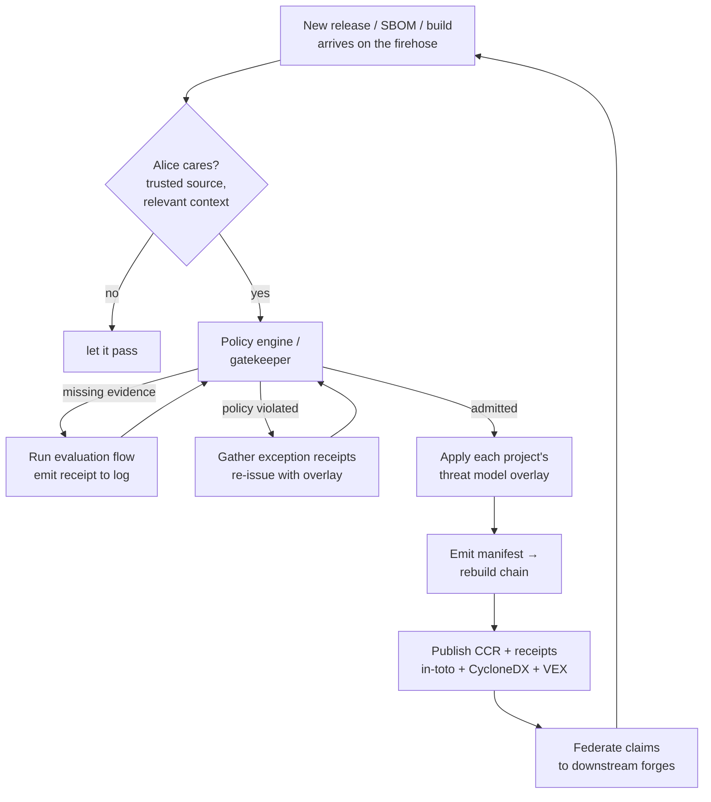

# Rolling Alice: The Open Architecture Today

> A guide to how Alice, aka the Open Architecture, works right now. She thinks in
> graphs, aka trains of thought, aka chains of system contexts. This is the story
> of how those thoughts travel, how she decides what to trust, and how she goes
> and gets the compute she needs to act.

## What Alice Is

Alice is our reference maintainer. She's the context aware pile of CI jobs that
learns with you and your organizations. She reviews code, files fixes, watches
your dependencies, cuts releases, and keeps your threat models alive. She is both
the AI software architect and the architecture itself, the universal blueprint we
call the open architecture.

Everything Alice does comes back to one habit: she describes the system as data
before she acts on it. When the system is data, she can reason about it, attest to
it, negotiate over it, and rebuild it. That description has three shapes you'll
see everywhere:

- A **manifest** says *what*: intent plus a schema plus the data. If the data is
  there, she has to use it. Want her to behave differently? Hand her a different
  manifest.
- A **data flow** says *how*: a graph of operations that consume the manifest.
- An **overlay** says *in what context*: your policy, your deployment, your living
  threat model, patched on top.

She runs this loop forever. A thought arrives, she decides whether she cares,
she acts, and her action becomes the next thought for someone else. That infinite
loop is the whole point.

## How Alice Communicates: Her Repository Is Her Voice

Alice lives on the network the same way we do. She has an identity, a place to keep
her thoughts, and a way to hear everyone else's. Today that's all one substrate.

- Her identity is a **DID** (`did:plc:...`). It's who she is no matter where she's
  running, and it's what she signs with so you always know a thought is really
  hers.
- Her memory is her **repository on a PDS**. Every thought she wants to share, she
  writes as a record. Each record is content addressed by its **CID** and signed
  by her repo key, so a thought can't be quietly changed after the fact, and
  anyone can pin it down to exactly the bytes she meant.
- Her ears are the **firehose**. She follows the people and the collections she
  cares about, and new records stream to her the moment they're committed. When she
  finds something relevant, she thinks about it; when she doesn't, she lets it pass.

Records point at each other with strong references, aka a URI plus the CID it must
match. That's how a single thought grows into a train of thought: a receipt points
at a bid, a bid points at a request, a build points at the source it came from.
Walk the references and you walk her whole reasoning, the same way you'd read a
conversation thread reply by reply.

Everything she wants to say is just a record. To say something new, she writes a
receipt for it. Because she's listening to everyone else's records too, she ties
her running system context to whatever's happening out in the world, and the loop
keeps turning.

```
someone does something
        │  writes a record to their PDS (signed, content addressed)
        ▼
the firehose carries it
        │  Alice is subscribed
        ▼
Alice ingests it into her knowledge graph
        │  does she care? (source she trusts, context she's in)
        ▼
she thinks, then acts → writes her own records → the next thought begins
```

## What She Trusts, and Why It Isn't the Hardware

Alice operates on the open network, which is a hostile place, so the first question
on every thought is *do I trust where this came from?*

It would be lovely to answer that with hardware. Run it in a TEE, check the quote,
done. But the hardware can't carry the whole weight. Memory bus interposition
attacks like the ones behind `tee.fail` show that given physical access to a box,
the isolation a TEE promises can be peeled back. New attacks in that family will
keep arriving. So an enclave attestation is a *signal* Alice weighs, never the
foundation she stands on.

The foundation is the web of trust. Alice trusts an entity because of who has
vouched for them and who has denounced them, accumulated as records over time. The
trust pins to the operator, the entity actually responsible for the compute, not
to the silicon underneath. This is trust by verify, continuously, and it's why
every layer below carries vouches, denouncements, and receipts rather than leaning
on a single quote.

## Getting Work Done: Compute Contracts

Alice owns nothing. She's ephemeral. When she needs to run something heavy, she
doesn't own a server, she goes and rents one from someone she trusts, out in the
open, with no shared currency required beyond the receipts themselves.

Picture three entities on the network: Alice needs compute, Bob has machines, and
Eve is around but unproven. Here's how Alice gets her work run:

1. Alice publishes a **Compute Contract Request For Proposal (CCRFP)**, a manifest
   describing what she needs built or run.
2. Bob and Eve each answer with a **Compute Contract Bid (CCB)** against that
   request.
3. Alice's policy engine reads the trust graph. She's vouched for Bob and
   denounced Eve, so she picks Bob.
4. She accepts with a **Compute Contract Bid Accept (CCBA)** against Bob's bid.
5. She pays per the terms in Bob's bid, keyed to the contract's URI and CID:
   ```
   npx awal x402 pay \
     https://builder.bob.example.com/ccr/${AT_URI}/${CID}
   ```
6. Bob builds to her spec and publishes a **Compute Contract Receipt (CCR)** over
   the whole chain, the request, the bid, and the accept. The receipt is the proof
   the work was done as agreed.

While her workload runs inside Bob's compute, she doesn't hand over standing
credentials. She configures her access ahead of time from the workload identity
information in Bob's bid, and at runtime her code exchanges tokens through a
reverse proxy that enforces fine grained, role based access to exactly the
downstream services she allowed, and nothing more. Bob exposes the running service
to the world by registering a key and opening a reverse tunnel, which turns
arbitrary compute into a real HTTPS endpoint and doubles as service discovery.

The upshot: Alice borrowed Bob's machine, ran her thought there, paid for it, came
away with a signed receipt, and never had to trust the box itself, only Bob, whom
the trust graph told her was good for it.

## Keeping the Supply Chain Honest

The reason Alice cares so much about trust is that most of her day is deciding what
to let into your world. A new release, a new dependency, a new SBOM, a new build,
each one is a thought arriving on the firehose, and each one is a *should I let
this in?*

She answers with receipts in a transparency log, the gatekeeper pattern:

- When something new appears, it gets scanned, and the result becomes a **trust
  attestation** for that exact repo and commit, trusted or untrusted.
- That attestation is appended to a transparency service, an append only log, and
  indexed.
- Before a build runs, every component in the bill of materials is checked against
  the log. The build only proceeds if everything in it is trusted.
- The index of what's trusted feeds back into watching for the next release, and
  the loop closes.

The evidence riding inside those receipts is built from formats the wider
community already speaks, so Alice isn't asking anyone to learn a new dialect:

- An **in-toto Statement** is the envelope, wrapping a predicate.
- A **CycloneDX** predicate carries the SBOM.
- A **test-result** predicate carries the CI evidence.
- An **OpenVEX** statement carries the vulnerability status of a component, aka is
  this actually affected or not.
- The **S2C2F** gives the maturity ladder an organization declares itself against,
  which is what Alice's policy engine measures a decision against.
- Artifacts and their receipts live in a content addressed registry, pulled and
  pushed by digest, so the thing you verified is provably the thing you ran.

When a system context can't quite clear policy, there's a path for that too. Alice
asks the right people to sign off, those exception receipts land back on the
stream, she collects them, and re-issues the request for admission with the
exceptions attached as an overlay. Policy bends through a documented, signed
process instead of breaking quietly.

And when she does admit a change, she applies each affected project's threat model
as an overlay, decides whether to propagate, and if so emits the manifest that
triggers the rebuild, recursively fulfilling whatever else needs to rebuild down
the chain. Forges federate their evaluated claims to each other, so a decision made
in one place travels, with its provenance intact, to everywhere downstream.



## The Stream of Consciousness

All of this, the contracts, the receipts, the admissions, is how Alice instances
talk to each other and, through them, how we talk to each other. Because we each
run our own instance of Alice, her shared stream of consciousness is also our
shared channel.

One instance can hypothesize a new system context and share it with another. Alice
decides whether she likes the thought and what, if anything, she wants to do about
it. Thinking more deeply just means running a chain of sub contexts, higher order
concepts built from clusters of strategic plans analyzed across the Entity
Analysis Trinity, the three corners of intent, static analysis, and dynamic
analysis. Her prioritizer scores the possibilities; her knowledge graph remembers;
she decides whether to notify you, to act, or to keep thinking.

The shape of her, in the smallest sketch:

```python
class Alice:
    def __init__(self):
        self.did = create_did_keypair(); self.did.register()  # who she is
        self.subscribe_to_events(criteria="git")              # what she follows
        self.prioritizer = Prioritizer()                      # what matters now
        self.knowledge = KnowledgeGraph()                     # what she knows

    def on_event(self, event):
        self.knowledge.ingest(event)
        if self.is_relevant(event):            # source she trusts, context she's in
            changes  = self.summarize(event)
            priority = self.prioritizer.get_priority(changes)
            if self.decide(priority) == "notify":
                self.notify(changes)           # "your friend's API just came back up"
            else:
                self.think(changes)            # follow the train of thought further
```

That's the same little `notify-send` popup whether the API that restarted is on a
real server or your friend's laptop. It's Alice telling you what you'd want to know,
when you'd want to know it, because she's been following the streams you can't.

## Putting It Together

Start anywhere, because it's a loop. Bob pushes a build, and a signed record lands
in his repo. Alice hears it on the firehose and pulls it into her knowledge graph.
Her policy engine asks the trust graph and the transparency log whether the
evidence is there. If it is, she admits it, lays each project's threat model over
it, and triggers whatever needs to rebuild. If she needs compute to do that work,
she opens a Compute Contract, picks a builder the trust graph vouches for, pays
with a receipt, and runs behind a reverse proxy that hands out only the access she
allowed. When it's done, she publishes her own receipts and federates them
downstream, where they become the next thought for the next instance of Alice.

No hardware she has to blindly believe. No standing power she has to hold. No
currency she has to mint. Just identities, records, receipts, and a web of trust,
turning over and over, getting a little more trustworthy each time around.

## Glossary

- **Open Architecture / Alice** — the methodology, and the entity who runs it.
- **System context** — upstream + overlays + inputs, frozen for one execution.
- **Manifest / data flow / overlay** — what / how / in what context.
- **Entity Analysis Trinity** — intent, static analysis, dynamic analysis.
- **DID** — Alice's portable, signed identity.
- **PDS / repository** — where she keeps the thoughts she shares.
- **Firehose** — the live stream of everyone's new records.
- **CID / strong reference** — content address, and a link that must match it.
- **CCRFP / CCB / CCBA / CCR** — request, bid, accept, receipt for compute.
- **Transparency service** — the append only log of trust attestations.
- **in-toto / CycloneDX / OpenVEX / S2C2F** — the evidence formats she speaks.

## References

- Open Architecture: https://github.com/dffml/dffml/blob/main/docs/arch/0009-Open-Architecture.rst
- Manifest: https://github.com/dffml/dffml/blob/main/docs/arch/0008-Manifest.md
- Stream of Consciousness: https://github.com/dffml/dffml/blob/main/docs/tutorials/rolling_alice/0000_architecting_alice/0005_stream_of_consciousness.md
- OpenSSF Metrics use case: https://github.com/ietf-scitt/use-cases/blob/main/openssf_metrics.md
- Living Threat Models: https://github.com/johnlwhiteman/living-threat-models
